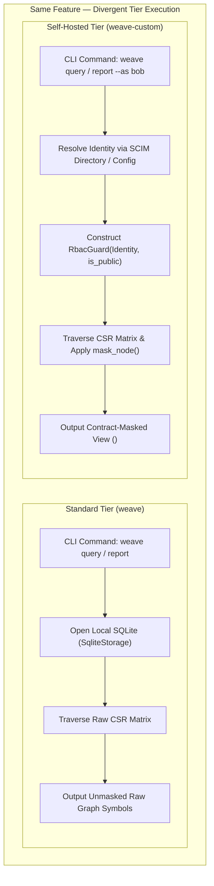

# Weave Graph: Master Feature vs. Tier Execution Matrix

> **Document**: `docs/feature_matrix.md`  
> **Status**: Living Reference of Feature Execution Semantics across Standard vs. Self-Hosted Tiers.  
> **Scope**: Detailed comparison of execution behavior, storage engines, permissions, and CI gating for all implemented and planned capabilities.

> **⚠️ Historical-reference note**: this matrix was audited on 2026-09-13, but later security fixes changed Hub authentication, snapshot verification, and other statuses. Use [issues.md](issues.md) for the current issue register and [impl.md](impl.md) for implementation status. Do not treat the dated rows below as a current feature guarantee; several original flags and capabilities were removed as inventions in the earlier audit.

---

## 1. Executive Summary & Tier Architecture

Weave Graph is built around two distinct compile-time distribution tiers to ensure that individual developers and open-source workflows never pay the memory, binary-size, or network footprint of enterprise governance systems:

1. **Standard Tier (`weave`)**:
   - **Target**: Small organizations, startup developers, individual engineers, CI/CD PR runners, and standalone monorepos / open-source projects.
   - **Guarantees**: Zero-LLM, zero outbound network, <80MB peak RAM (measured ~60MB for 500k symbols). Stripped release binary: 41.1MB for a bare `cargo build --release` (all 29 languages, the actual default), 9.6MB with `--no-default-features` (8 core languages).
   - **Packaging**: Default build (`cargo build --release -p weave-graph-cli`, no flags). `--features team` is an explicit opt-in bundle (`docs` + `federation`), not what a bare build produces.
2. **Self-Hosted Tier (`weave-custom`)**:
   - **Target**: Self-hosted engineering teams, private VPCs, private clouds, air-gapped compliance deployments, and multi-team microservice meshes.
   - **Guarantees**: Query-layer RBAC masking, SCIM 2.0 IdP directory sync, a snapshot-signing trait boundary (`hub-provenance`), centralized Hub registry, vector search, and OpenTelemetry trace overlays.
   - **Packaging**: Enterprise build (`cargo build --release -p weave-graph-cli --features custom`).

---

## 2. Master Feature vs. Tier Execution Matrix

| Feature / Command | Standard Tier (`weave`) Execution | Self-Hosted Tier (`weave-custom`) Execution | Access Control & Permissions | Underlying Storage Engine |
| :--- | :--- | :--- | :--- | :--- |
| **AST Indexing (`weave index`)** | Parses source ASTs; builds local `nodes`, `edges`, `contracts` in `.weave/graph.db`. | Identical AST parse; additionally builds `vec_chunks` (vector) and parses markdown wikilinks (`docs`). | Unrestricted local execution. | SQLite WAL mode (or optional Turso libSQL). |
| **Graph Query (`weave query "<expr>"`)** | Executes unweighted BFS/traversals over local CSR matrix; returns raw symbol metadata. | Runs BFS; filters output in-place through `RbacGuard` based on `--as <subject>` (or `anonymous`). | **Standard**: Unrestricted.<br/>**Self-Hosted**: Query-layer masked. | SQLite (or Turso) -> in-memory CSR matrix. |
| **Symbol Search (`weave search "<query>"`)** | BM25 full-text search over `symbol_fts` with query synonym expansion (`fts`). | Identical BM25 search; results post-filtered through `RbacGuard` visibility rules. | **Standard**: Unrestricted.<br/>**Self-Hosted**: Hidden nodes dropped. | SQLite FTS5 virtual table. |
| **Semantic Search (`weave search --semantic`)** | Optional via `--features vector`; uncompiled in minimal standard binary. | 3-stage funnel: 1-bit binary ANN oversampling + int8 scalar rescore via `sqlite-vec`. | **Standard**: Unrestricted.<br/>**Self-Hosted**: Visibility filtered. | `vec0` virtual table in SQLite (`vec_chunks`). |
| **Blast Radius (`weave blast <sym>`)** | Transitive caller reachability using `RoaringBitmap` bitsets over the in-memory CSR graph. | Reachability over CSR; masks unreachable or hidden private nodes in output report. | **Standard**: Unrestricted.<br/>**Self-Hosted**: Masked report. | In-memory CSR + Roaring Bitmap. |
| **Contract Checks (`weave check-contracts`)** | Computes M2.2 contract hashes; fails under `staleness_policy = "strict"` if consumer/producer expectations diverge. | Identical contract diffing; same waiver mechanism, additionally role-gated when `rbac` is compiled and an identity is bound. | **Standard**: Unrestricted waiver.<br/>**Self-Hosted**: Needs `allow-drift` role (only when `--as` is actually given — see §5). | `.weave/graph.db` contract tables. |
| **Contract Waivers (`--allow-drift`)** | Always permitted; bypasses CI gate (stderr banner + Waiver Notice in output). | Authorized only if an `--as <subject>` identity holds the `allow-drift` role (resolved from `[rbac.users]` and/or the SCIM directory); requires `--reason`. | **Standard**: Open.<br/>**Self-Hosted**: Role-gated + audit trail. | Checked against `RbacGuard::can_waive()`. |
| **Boundary Linting (`weave policy lint`)** | Lints local `.weave/policy.yaml` boundary rules (`disallow`/`require`) against AST edges; always exits non-zero on any violation. | Evaluates policy rules over the masked view; drops edges touching hidden nodes and logs a skipped count. | **Standard**: Evaluates all local edges.<br/>**Self-Hosted**: Evaluates visible subgraph only (a real false-negative risk — see `issues.md` POL-01). | SQLite `nodes` + `edges`. |
| **Architecture Drift (`weave policy drift`)** | Identifies file-level dependency cycles and orphan files (0 inbound edges); always advisory, never fails CI. | Computes cycles/orphans over the visible graph; can produce false orphan signals from hidden edges (`issues.md` POL-03; later fixed/annotated). | **Standard**: Unfiltered graph.<br/>**Self-Hosted**: Filtered visible graph. | SQLite `nodes` + `edges`. |
| **Reports & Export (`weave report`, `export`)** | Generates `WEAVE_REPORT.md` and a local JSON Canvas (`.canvas`) architecture map. | Generates report/export with internal symbols masked as `<rbac: hidden>` unless caller is `internal`. | **Standard**: Full symbol visibility.<br/>**Self-Hosted**: Contract-boundary masked. | Local file write (`WEAVE_REPORT.md`). |
| **AI Agent MCP Server (`weave serve --mcp`)** | Stdio transport exposing 4 tools (`repo_map`, `file_api`, `trace_calls`, `impact_radius`). | Stdio/HTTP transport; masks all tool responses through session `RbacGuard` identity. | **Standard**: Full access.<br/>**Self-Hosted**: Identity-masked tools. | Loopback stdio / HTTP. |
| **Pinned Notes (`weave pin`, `weave recall`)** | Attaches ephemeral/crystallized notes to symbols; reattaches by moniker on reindex. | Identical note persistence; filters recalled notes through `RbacGuard` visibility rules. | **Standard**: All notes visible.<br/>**Self-Hosted**: Masked notes. | SQLite `notes` table with BLAKE3 hashes. |
| **Runtime Traces (`weave traces import`)** | Purely local span ingestion (`TraceSpan`); matches symbols to overlay latency metrics. | Ingests spans; integrates with OpenTelemetry trace collectors (`otel`). | **Standard**: Local file import.<br/>**Self-Hosted**: Distributed OTel integration. | SQLite `trace_spans` table. |
| **Snapshot Sync (`weave sync push/pull`)** | Uncompiled / unavailable in base standalone CLI. | Synchronizes graph snapshots to a centralized Hub registry over HTTP. | **Standard**: N/A.<br/>**Self-Hosted**: Unauthenticated (loopback-bind is the only access control, Core Invariant 6). | Centralized disk-spool blob store. |
| **Snapshot Provenance (`hub-provenance`)** | Not available. | `SnapshotProvenanceVerifier` trait: signs/checks a hash-chained signature over `(repo, sha, payload)`. Signing is wired into `weave sync push --signature`; later work added opt-in registry-side verification with an operator key. | **Standard**: N/A.<br/>**Self-Hosted**: Verification requires explicit configuration (`issues.md` PROV-01). | FNV-1a hash chain, not a Merkle tree. |
| **Centralized Hub (`weave-graph-hub`)** | Not compiled; CLI is self-contained. | Standalone registry daemon; per-repo worker threads, disk spooling, conflict resolution. | **Standard**: N/A.<br/>**Self-Hosted**: Single-tenant per repo; no cross-repo mesh evaluation. | Dedicated hub store directory. |
| **Directory Sync (`weave rbac serve-scim`)** | Not compiled. | Loopback, unauthenticated SCIM 2.0 server ingesting subject→role provisioning from any SCIM-capable IdP. | **Standard**: N/A.<br/>**Self-Hosted**: Enterprise IdP integration (subject-level only, no group provisioning). | `.weave/rbac-directory.toml`. |
| **Local SLM & Ask (`weave slm`, `weave ask`)** | Uncompiled in base tier. | Offline small language model inference (`slm`) for natural language graph querying and journals. | **Standard**: N/A.<br/>**Self-Hosted**: Local offline neural execution. | Verified publisher GGUF weights. |

---

## 3. Deep-Dive Execution Breakdown by Capability



---

### 3.1 Graph Traversal & Querying (`weave query`, `weave blast`)
* **Standard Tier**:
  - Unrestricted direct execution over the in-memory CSR matrix.
  - Queries return actual symbol names, file paths, and exact start/end line numbers.
  - Blast radius calculates transitive closures across all files regardless of visibility.
* **Self-Hosted Tier**:
  - Resolves identity from `--as <subject>` via `[rbac.users]` and SCIM directory.
  - Every traversed `Node` is passed through `RbacGuard::mask_node()`.
  - Non-internal identities receive opaque stand-ins for private nodes:
    ```json
    {
      "symbol": "<rbac: hidden>",
      "path": "<rbac: hidden>",
      "kind": "<rbac: hidden>",
      "line_start": 0,
      "line_end": 0
    }
    ```

---

### 3.2 Contract Governance & CI Gating (`weave check-contracts`, `weave blast --pr`)
* **Standard Tier**:
  - Checks if public contract hashes differ between linked repositories.
  - If drift occurs, `--allow-drift` (or `--allow-drift-for <repo>`), or the `WEAVE_SKIP_CONTRACTS=1` / `WEAVE_ALLOW_DRIFT_REPOS=repo-a,repo-b` / `WEAVE_STALENESS_POLICY_OVERRIDE=warn|ignore` env vars, waive the check (see `docs/product/cli-reference.md` for the full flag/env-var list).
  - Generates a local warning notice.
* **Self-Hosted Tier**:
  - Gated by `waiver::authorize(root, as_subject)`.
  - Bypassing a contract divergence requires:
    1. An explicit identity (`--as <subject>`) possessing the `"allow-drift"` role.
    2. A mandatory reason string (`--reason "Migration in progress: JIRA-123"`).
  - Emits a structured Markdown Waiver Notice artifact into CI pull request comments for regulatory compliance.

---

### 3.3 Search & Information Retrieval (`weave search`)
* **Standard Tier**:
  - **Lexical BM25 Search**: Fast FTS5 queries against symbol names and signatures with synonym expansion (e.g. `auth` -> `authenticate`, `login`, `verify`).
  - Instant microsecond response, zero neural weights.
* **Self-Hosted Tier**:
  - **Hybrid Search**: Combines BM25 with Tier 2 Vector Semantic Search (`--features vector`).
  - Computes 384-dimensional embeddings via `EmbeddingProvider`.
  - Queries `sqlite-vec` virtual table using 1-bit Hamming distance pre-filtering oversampled by $4\times$, followed by an int8 scalar dot-product rescore.
  - Filters results through `RbacGuard` so unauthorized users cannot discover internal code spans.

---

### 3.4 Architecture Linting & Drift (`weave policy lint`, `weave policy drift`)
* **Standard Tier**:
  - Lints declared boundary rules in `.weave/policy.yaml` across all local files.
  - Detects physical dependency cycles and files with zero inbound references.
* **Self-Hosted Tier**:
  - Integrates with RBAC: ignores edges touching hidden nodes during external audits (see `issues.md` POL-01/POL-03 for current status).
  - `lint` always exits non-zero on any violation, unconditionally; `drift` always exits `0` (purely advisory). Neither has a severity-mode flag.
  - Single-repo only — no cross-repo/mesh policy linting exists yet (`issues.md` FED-01, HUB-03).

---

## 4. Runtime Modes vs. Tiers Matrix

`mode` (`weave init --mode <value>`) is a two-value runtime setting — `"single"` (default) or `"multiple"` — orthogonal to which Cargo features a binary was built with. A `weave-custom` (`--features custom`) binary still runs with `mode = "single"` or `"multiple"` like any other build; there is no `mode = "custom"` value.

| Mode Configuration in `config.toml` | Standard Tier (`weave`) Capability | Self-Hosted Tier (`weave-custom`) Capability |
| :--- | :--- | :--- |
| **`mode = "single"`** | Standalone local monorepo indexing, blast radius, reports, and local stdio MCP server. | Standalone monorepo with query-layer RBAC masking, OTel trace overlays, and local SLM journals. |
| **`mode = "multiple"`** | Local multi-repo federation: links sibling directories via `[federation] linked_repos` and checks cross-repo contract hashes. | Local multi-repo federation with RBAC masking across repositories and role-gated contract waivers. |

`--features custom` additionally enables (regardless of `mode`): the Hub snapshot registry daemon (`weave-registry`, a separate binary) and its client (`weave sync push/pull`), and the SCIM 2.0 directory server (`weave rbac serve-scim`). There is no cross-repo "mesh" beyond pairwise `weave link`/`weave check-contracts --scoped` (see `issues.md` FED-01, HUB-03).

---

## 5. CLI Flag & Environment Variable Divergence

| CLI Flag / Environment Variable | Standard Tier Behavior | Self-Hosted Tier Behavior |
| :--- | :--- | :--- |
| **`--as <subject>`** | Ignored (or diagnostic warning: RBAC not compiled). | Resolves subject against `.weave/config.toml`'s `[rbac.users]`, overlaid with the SCIM directory (directory wins for the same subject), and applies `RbacGuard`. |
| **`--allow-drift`** | Permits waiver unconditionally (no `rbac`, or `rbac` compiled but `--as` omitted). | With `rbac` compiled **and** `--as` given: requires the identity to have the `"allow-drift"` role and supply `--reason`. |
| **`--reason <text>`** | Optional advisory note. | **Mandatory** when waiving gates via CLI flags (`--allow-drift`/`--allow-drift-for`/`--skip`); not required for the env-var bypass paths. |
| **`--semantic`** | Disabled (unless compiled with `--features vector`) — available in *any* tier, not exclusive to Self-Hosted. | Executes 1-bit + int8 ANN search over `vec_chunks`. |
| **`WEAVE_SKIP_CONTRACTS` / `WEAVE_ALLOW_DRIFT_REPOS`** | Bypasses the gate unconditionally (no `--reason` needed — the env var itself is the audit trail). | With `rbac` compiled and `--as` given, still gated by the `"allow-drift"` role. |
| **`WEAVE_HOME`** | Relocates the CLI's own `.weave/graph.db` data directory. | Same — does **not** relocate the SCIM directory file (always `.weave/rbac-directory.toml` relative to the repo root) or the Hub registry's spool (a separate server process, configured via its own `--data-dir` flag, unrelated to a client's `WEAVE_HOME`). |

`weave report`/`weave export` have no `--format` flag at all (the related config key is `.weave/config.toml`'s `[report] format`, values `"canvas"`/`"html"`/`"all"` — Mermaid is never an output format anywhere in this codebase), so no row for one appears above.
