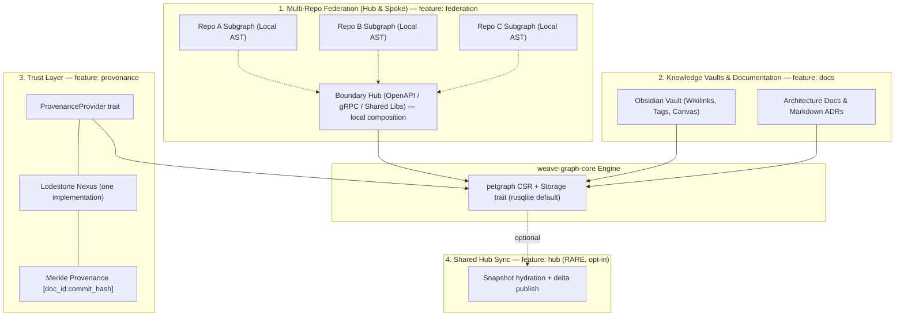
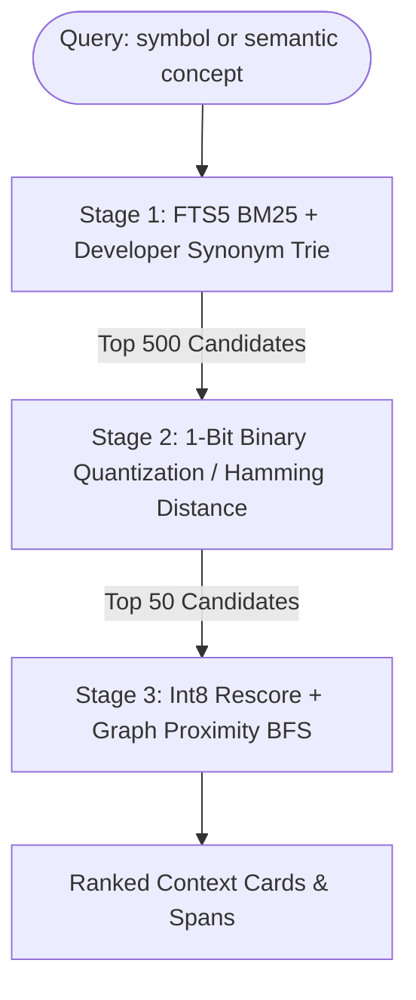
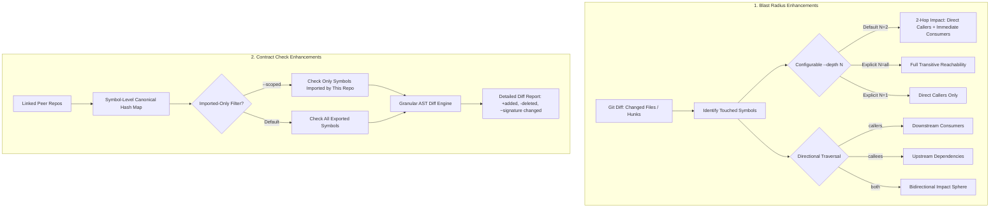

# `weave-graph`: Product and Architecture Plan

**Authority and status:** This file records approved product direction, not
proof that every capability below is implemented. The development checklist
and actual milestone status are in [impl.md](impl.md); unresolved and deferred
items are in [issues.md](issues.md). Historical projected timings, memory
claims, and feature descriptions in older sections are targets until measured
against the current tree. The core <15 MB target is for
`cargo build --release -p weave-graph-cli --no-default-features`, not the
Cargo-default `lang-extended` build.

> **`weave-graph` (CLI: `weave`) is a local, deterministic code-intelligence engine built from Rust, Tree-sitter, an embedded SQL store, and compact graph traversal.** Optional features add document, federation, semantic, and organizational workflows. Token savings are a measurement goal, not a universal percentage claim.
>
> **Advanced capabilities are compile-time features.** The minimal core is built with `--no-default-features`; Cargo defaults currently include extended-language grammars and are a different, larger artifact. See §0 and §6.

---

## Architecture Principles & Constraints

1. **Zero-Fat & Low Resource Footprint**:
   - Compiled binary < 15 MB, memory footprint < 80 MB RAM for 500k+ code symbols.
   - 100% CPU-safe, deterministic execution. Runs smoothly on legacy hardware (e.g., dual-core CPUs, 4GB RAM) without requiring a GPU, NPU, or local SLM.
2. **Crash-Resilient Indexing**:
   - Replaces fragile in-memory Python dictionaries with Rust Compressed Sparse Row (CSR) adjacency (`petgraph::csr`) plus an embedded SQL store, eliminating Out-Of-Memory (OOM) failures on large monorepos and multi-repo codebases.
   - **No indexing path may leave the database corrupt on crash.** Bulk rebuilds are written to a separate file and atomically renamed into place; a kill mid-rebuild leaves the previous index fully intact. Durability PRAGMAs are never weakened on a file that readers are using.
3. **Graft-Style Token Reduction (Exact Line Spans)**:
   - Implements progressive 3-tier context disclosure and per-file wiring cards (`file:line_start-line_end`), cutting AI agent discovery token usage by up to 92%.
4. **Progressive Modular Enhancement (Feature-Gated, Default-Off)**:
   - The core deterministic graph engine operates independently and is the only mandatory component. Every advanced capability — document linking, cryptographic provenance, hub sync, RBAC, SLM intent routing — is a **compile-time Cargo feature** and a **runtime config section**, both off by default.
   - Consequence: the default build has no network stack, no auth code, and no sync machinery linked in. Capabilities a deployment does not use cost it nothing in binary size, RAM, attack surface, or configuration burden.
   - **No feature may become a prerequisite for a lower tier.** A solo user must never need team configuration; a team must never need custom infrastructure.
5. **Agent-Native & Protocol-First**:
   - Exposes dynamic graph traversal tools (`weave_repo_map`, `weave_file_api`, `weave_trace_calls`, `weave_impact_radius` — see §1.5) over the Model Context Protocol (MCP).
6. **Universal & Language-Agnostic Core**:
   - The core indexing engine, AST parser, and graph traversal tools are strictly universal (English, international codebases, standard ASTs). Multilingual adapters or regional models are strictly optional, non-mandatory plugins.

---

```text
                          weave-graph Ecosystem (Feature Tiers)
┌────────────────────────────────────────────────────────────────────────────────────────┐
│ PHASE 3 — features: rbac, otel, policy-lint            [CUSTOM, opt-in]                │
│ • Query-layer node masking & SSO • Graph Policy Linter • OpenTelemetry Overlay         │
├────────────────────────────────────────────────────────────────────────────────────────┤
│ PHASE 2 — features: docs, federation, provenance, slm, hub  [TEAM / rare HUB, opt-in]  │
│ • Obsidian Wikilinks & Canvas • Multi-Repo Federation • Provenance                     │
│ • Local Intent Router (weave ask) • Optional Hub Sync                                  │
├────────────────────────────────────────────────────────────────────────────────────────┤
│ PHASE 1 — default build, no features required          [ALWAYS PRESENT]                │
│ • <15MB binary, <80MB RAM • Pure CPU • Tree-sitter AST • Embedded SQL • Local MCP      │
└────────────────────────────────────────────────────────────────────────────────────────┘
   Compiling with zero features yields a complete, useful, single-user tool.
```

---

## 0. Modular Architecture & Feature Configuration

_This section governs every phase below. Capabilities are added by enabling a feature, never by modifying the core._

### 0.1 Crate Layout

Separation is enforced by crate boundaries, so a tier cannot accidentally depend on a higher one:

**Crate names are prefixed `weave-graph-*`, not bare `weave-*`.** `weave-core`, `weave-cli`, and `weave-mcp` are already published on crates.io by an unrelated existing project (an entity-level semantic-merge toolkit with its own CLI and MCP server) — an adjacent enough space that reusing those names risks real confusion, not just registry conflict. Every internal crate below is confirmed available under the `weave-graph-` prefix. The public binary is still named `weave` — this only affects the internal Cargo package ids.

| Crate                      | Responsibility                                                                                                                                | Depends On         |
| :------------------------- | :-------------------------------------------------------------------------------------------------------------------------------------------- | :----------------- |
| `weave-graph-core`         | Graph model, CSR adjacency, traversal algorithms, storage trait definitions. No I/O backend, no network.                                      | —                  |
| `weave-graph-parse`        | Tree-sitter AST extraction, wiring-card generation, language adapters.                                                                        | `weave-graph-core` |
| `weave-graph-store-sqlite` | Default storage-trait implementation (`rusqlite`).                                                                                            | `weave-graph-core` |
| `weave-graph-store-turso`  | Optional storage-trait implementation. Feature-gated.                                                                                         | `weave-graph-core` |
| `weave-graph-mcp`          | MCP transport adapter and tool surface.                                                                                                       | `weave-graph-core` |
| `weave-graph-cli`          | The `weave` binary; wires the above per enabled features.                                                                                     | all of the above   |
| `weave-graph-hub`          | Optional delta ingestion/publish service. Never linked into the default binary.                                                               | `weave-graph-core` |
| `weave-graph-python`       | Optional PyO3 bindings for the `pip install weave-graph` wheel (§1.1; shipped by `impl.md` M2.8, excluded from the default workspace builds). | `weave-graph-core` |

### 0.2 Cargo Feature Matrix

| Feature          | Default | Enables                                                                                                                                                                                                                                 | Tier            |
| :--------------- | :------ | :-------------------------------------------------------------------------------------------------------------------------------------------------------------------------------------------------------------------------------------- | :-------------- |
| _(none)_         | ✅      | Local index, query, MCP server, report. Complete single-user tool.                                                                                                                                                                      | `[P1]`          |
| `docs`           | ❌      | Markdown/Obsidian ingestion (`pulldown-cmark`), wikilinks, `.canvas` export.                                                                                                                                                            | `[P1]`/`[TEAM]` |
| `federation`     | ❌      | Multi-repo subgraph composition, boundary hub, contract hashing. **Local-only; no network.**                                                                                                                                            | `[TEAM]`        |
| `hub`            | ❌      | Snapshot hydration and delta publish over the network. Pulls in the HTTP stack.                                                                                                                                                         | `[HUB]` (rare)  |
| `provenance`     | ❌      | `ProvenanceProvider` trait + Merkle-signed note linking.                                                                                                                                                                                | `[TEAM]`        |
| `rbac`           | ❌      | `AuthProvider` trait + **query-layer** node masking.                                                                                                                                                                                    | `[CUSTOM]`      |
| `otel`           | ❌      | OpenTelemetry/APM trace overlay onto graph nodes.                                                                                                                                                                                       | `[CUSTOM]`      |
| `policy-lint`    | ❌      | YAML architectural boundary rules + CI gate.                                                                                                                                                                                            | `[CUSTOM]`      |
| `slm`            | ❌      | Local NL→query intent router for **humans at a terminal** (`weave ask`). Never on the MCP/agent path; never required. See §2.4.                                                                                | optional        |
| `python`         | ❌      | PyO3 bindings for the `pip install weave-graph` wheel.                                                                                                                                                                                  | optional        |
| `turso`          | ❌      | Swaps the storage backend to `libSQL`/Turso.                                                                                                                                                                                            | optional        |
| `notes`          | ❌      | Cross-agent pinned memory notes on graph nodes (`weave note pin`/`weave_recall_notes`), two-tier ephemeral/crystallized lifecycle, `blake3` content-hash staleness. See `impl.md` M2.10.                                                | optional        |
| `watch`          | ❌      | File-watcher auto-sync with blast-radius gating (`notify`). An operational convenience orthogonal to tier, not a `[P1]`/`[TEAM]`/`[CUSTOM]` capability rung. See `impl.md` M2.11.                                                       | optional        |
| `viz`            | ❌      | Optional browser viewer for `weave report` output. **Implemented** (was deferred at planning time; shipped by `impl.md` M2.13 — offline static bundles + optional loopback server mode). See `impl.md` M2.13.                           | optional        |
| `fts`            | ❌      | Tier 1 hybrid search: SQLite FTS5 + synonym-expanded BM25, `weave search` (M3.7).                                                                                                                                                       | optional        |
| `vector`         | ✅      | Tier 2 opt-in embedding retrieval via `sqlite-vec` (depends on `fts`; M3.7). Source chunks and sync-side exclusions are streamed and enforced before snapshot publish.                                                                  | optional        |
| `hub-provenance` | ✅      | Snapshot-level Merkle signature trait boundary for the hub registry (M3.6, done — trait, transport, registry-side canvas/webhooks, and CLI-side `weave sync push --signature` all wired; `weave` ships no signer of its own by design). | optional        |

Convenience bundles: `team = ["docs", "federation", "fts", "vector"]`, `custom = ["team", "hub", "provenance", "rbac", "otel", "policy-lint", "fts", "vector"]` — the target design, now that all five Custom capabilities _and_ the two retrieval tiers exist (`weave-graph-cli/Cargo.toml`'s `custom` is wired exactly this way as of 2026-09-12; the earlier "wired as `["team", "hub", "provenance"]` today" note is retired with the gap it described).

**`federation` deliberately excludes networking.** Multi-repo work on one machine (`weave link`) needs no hub; only `hub` adds a network dependency. This keeps the common multi-repo case free of server infrastructure.

**Exception to "every capability is a Cargo feature": base-tier quality fixes may land ungated.** A fix that only improves a capability every build already ships — e.g. `weave serve --mcp` staying fresh after an external reindex, or capping an existing MCP tool's response size — carries no new capability surface to gate, so it ships directly in the base tier rather than waiting on a feature flag. This does not extend to anything that adds a new capability (that still needs its own feature, per Principle 4 above); see `impl.md` M2.15/M2.16 for the two instances of this exception so far.

### 0.2a Feature Resolution Happens at Build Time, Not at Runtime

Cargo feature flags gate `[dependencies] optional = true` crates. This already gives "minimum download by default" for free — no plugin system needed:

- **Building or installing from source** (`cargo install weave-graph-cli`) with no `--features` flag: Cargo resolves and downloads only `weave-graph-core`'s dependencies (`petgraph`, `rusqlite`, `tree-sitter-*`). It never touches `reqwest`, a Turso client, or any auth crate, because nothing in the dependency graph references them.
- **Enabling a feature** (`cargo install weave-graph-cli --features team`, or `--features custom`) downloads and compiles exactly that feature's added dependencies **as part of that build** — a few extra seconds of `cargo build`, not a separate step.
- **There is no mechanism to add a dependency to an already-compiled binary without rebuilding it.** A static Rust binary is fixed at compile time; "download `turso`'s client later, after install, without recompiling" would require a genuine dynamic-plugin architecture (`libloading`/`dlopen`, a stable plugin ABI, versioned interfaces) — Rust has no stable ABI across compiler versions, so this is real, ongoing engineering cost. **Not adopted**: no deployment tier in this plan needs it, and Cargo's own feature-flag rebuild is simpler and sufficient.
- **Prebuilt binary distribution** (GitHub Releases, Homebrew, apt) ships a **small, named set of variants** built from the bundles in §0.2, not one binary that grows itself: `weave` (no features), `weave-team` (`--features team`), `weave-custom` (`--features custom`). Moving from `weave` to `weave-team` means installing the other prebuilt artifact, exactly like installing a different package — not an in-place upgrade of the running binary.
- **Config vs. compiled-in capability are different axes.** Setting `mode = "multiple"` or `[hub] url` in `.weave/config.toml` never grants a capability the binary wasn't compiled with. If `weave sync pull` or `weave check-contracts` is invoked on a binary built without `hub`/`federation`, it must fail immediately with a clear message (_"`hub` feature not compiled into this binary — reinstall `weave-team` or build with `--features hub`"_), never silently no-op.

### 0.3 Runtime Configuration (`.weave/config.toml`)

Compile-time features decide what _can_ run; config decides what _does_. Every section is optional, and an absent section means the capability is off — never a pending setup step.

```toml
mode = "single"                     # single | multiple. No "custom" value; see §1.3.

[storage]
backend = "sqlite"                  # sqlite (default) | turso
home = ""                           # optional central/custom storage path (default: <repo>/.weave/)
relocate_on_network_fs = false      # opt-in; default is warn-and-refuse (§1.4)

[index]
bailout_ratio = 0.10                # full rebuild above this share of changed files
bailout_floor = 100                 # ...but never below this absolute count

[federation]                        # requires feature = federation
linked_repos = []                   # paths populated by `weave link`
staleness_policy = "warn"           # warn | strict | ignore

[hub]                               # requires feature = hub; expected to be RARE
url = ""                            # unset is a fully supported permanent state
snapshot_retention = 20             # keep last N merge snapshots + release tags

[auth]                              # requires feature = rbac
provider = ""                       # okta | azure-ad | saml | oidc

[slm]                               # requires feature = slm
model = "qwen2.5-coder-0.5b-q4_k_m" # never auto-upgraded; weights not bundled
lazy_load = true                     # must stay true: 0 MB idle cost (§2.4)
```

**Implementation status of this config schema (2026-09-12 audit, consolidated rather than silently divergent):** `mode`, `[storage] home`, `[federation] linked_repos` + `staleness_policy`, `[hub] url` + `snapshot_retention` (sent as the `X-Weave-Retention` hint), and `[rbac.users]` are read by the binary exactly as written. Four rows are still aspirational and not read from config anywhere in the tree — treat them as planned surface, not shipped behavior: `[storage] backend` (the CLI hardwires the SQLite backend; the `turso` crate is compiled and tested but not yet selectable), `[storage] relocate_on_network_fs` (relocation today is `[storage] home` / `WEAVE_HOME` only, with warn-and-refuse as the network-FS default), `[index] bailout_ratio`/`bailout_floor` (the bailout logic is real and config-shaped, but `cmd_index` passes `ReindexConfig::default()` — the TOML keys are not read), and `[auth] provider` (identity resolution today is `[rbac.users]` plus M3.4's SCIM-managed directory; no `provider =` selector exists). `[slm] model`/`lazy_load` are likewise governed by the SLM registry/cache conventions, not read from this file.

### 0.4 Provider Traits (Swappable Integrations)

Named third-party systems are never referenced from the core. Each is one implementation behind a trait, so a vendor change or a dead upstream project cannot break `weave-graph`:

- `Storage` — `rusqlite` (default), Turso, or a Phase 3 server backend.
- `ProvenanceProvider` — Lodestone Nexus is _one_ implementation, not the interface.
- `AuthProvider` — Okta / Azure AD / SAML / OIDC.
- `McpTransport` — isolates the evolving MCP spec to a single adapter.

---

## Phase 1: weave-core Foundation (Core Engine & Developer Experience)

_Goal: Deliver an ultra-fast, local-first code graph engine that replaces heavy in-memory tools and provides seamless MCP integration for AI coding assistants._

### 1.1 High-Performance Graph Core (Dual-Target Rust & Swappable Embedded Store)

- **Dual-Target Distribution Architecture**:
  - **Native Standalone Binary (`weave`)**: Compiled pure Rust binary via Cargo (`rustworkx-core` / `petgraph` / custom CSR), requiring zero runtime dependencies (no Python, no Node.js).
  - **Python Bindings Package (`pip install weave-graph`)**: Optional PyO3 wrapper for Python scripting and data science workflows.
- **Storage Engine: Embedded SQL Behind a Trait (`rusqlite` Default)**:
  - All persistence goes through a minimal `Storage` trait (`get_node`, `get_edges`, `upsert_node`, `upsert_edge`, `query_path`, …). No core logic references a concrete backend.
  - **Default: `rusqlite`.** Mature, zero sync machinery, and a correct match for Phase 1's single-writer/read-heavy profile.
  - **Optional: Turso `libSQL` (`--features turso`).** Adds embedded replicas and native vector/FTS. Deferred by decision: `libSQL` offers no concurrency advantage over `rusqlite` (identical single-writer + WAL model), and the Turso Rust rewrite — while MVCC-based — remains beta and currently benchmarks _slower_ on scans and batched inserts, which is exactly this project's workload. Revisit when it exits beta.
  - Operates locally at `.weave/graph.db`.
  - **Schema versioning is mandatory from the first release**: a `schema_version` table plus a migration runner, so upgrading `weave` never forces users to discard and rebuild their index.
- **Normalized Storage Schema**:
  - `nodes`: `(id INTEGER PRIMARY KEY, repo_id TEXT, path TEXT, symbol TEXT, kind TEXT, line_start INT, line_end INT, signature TEXT)`
  - `edges`: `(id INTEGER PRIMARY KEY, source_id INTEGER, target_id INTEGER, kind TEXT, weight REAL)`
  - `doc_links`: `(id INTEGER PRIMARY KEY, doc_id INTEGER, section TEXT, target_node_id INTEGER, kind TEXT)`
  - `contracts`: `(id INTEGER PRIMARY KEY, service_a TEXT, service_b TEXT, protocol TEXT, schema_ref TEXT, contract_hash TEXT, source_commit_sha TEXT, published_at INTEGER)`
  - `schema_version`: `(version INTEGER PRIMARY KEY, applied_at INTEGER)`
  - `kind` columns stay `TEXT`, never a closed enum — new relationship types must be additive data, not a migration plus recompile.
- **Integer Compaction & CSR Adjacency**:
  - Map all file paths and symbol signatures to 32-bit integers (`uint32`).
  - Use `petgraph::csr::Csr` for contiguous adjacency rather than a hand-rolled matrix — the crate already provides it, and `rustworkx-core` builds on `petgraph` regardless.
  - For fast set-intersection on traversals, use `roaring` compressed bitmaps rather than bespoke SIMD bitmask code. Reserve custom SIMD for a case where profiling proves `roaring` insufficient.
  - **The SQL store is authoritative; CSR is a derived read structure** rebuilt on load. No bidirectional sync between them.

### 1.2 Deterministic AST Parsing & Graft-Style Token Reduction

- **Parser Integration**: Use `tree-sitter` (C/Rust) for deterministic, local AST extraction across major languages (TypeScript/JavaScript, Python, Go, Rust, Java, C/C++).
- **SCIP Moniker Support**: Incorporate SCIP compiler-accurate symbol monikers for precise cross-file reference resolution.
- **Two-Tier Edge Taxonomy**:
  - `CALLS_EXACT`: Deterministic direct function/method call where target is unambiguous.
  - `CALLS_DYNAMIC`: Polymorphic candidate resolution for interface/abstract method dispatches.
  - `IMPORTS` / `INHERITS` / `IMPLEMENTS`: Structural type and module hierarchy edges.
- **Per-File Wiring Cards (Micro-Context)**:
  - Generate concise in-memory cards recording symbol signatures and exact line ranges (`L20–L52`).
  - Enables AI agents to perform slice-edits on specific lines rather than ingesting entire source files.

### 1.2a Incremental Reindex Correctness & Bulk Bailout

- **Per-File Purge Must Clear Both Edge Directions**:
  - Reindexing a file purges its nodes and **every edge touching them in either direction**:
    ```sql
    DELETE FROM edges
     WHERE source_id IN (SELECT id FROM nodes WHERE path = ?)
        OR target_id IN (SELECT id FROM nodes WHERE path = ?);
    DELETE FROM nodes WHERE path = ?;
    ```
  - Purging only outbound edges (`source_id` alone) leaves inbound edges from other files pointing at deleted node ids. These orphans accumulate on every incremental pass and silently corrupt `weave_trace_calls` and `weave_impact_radius` — the engine's primary queries. Inbound edges are then re-derived from the referencing files.
  - **Required regression test**: index two mutually-referencing files, reindex one, assert zero edge endpoints reference a missing node.
- **Cycle-Safe Traversal (Core, Not Multi-Repo-Only)**:
  - All traversals (`impact_radius`, `trace_calls`, path finding) carry a visited set. Intra-repo cycles are common in ordinary code; without this, blast-radius queries loop or double-count. Tarjan's SCC at the federation hub addresses a _different_, additional problem and does not substitute for this.
- **Adaptive Bulk Bailout**:
  - Before per-file diffing, compare changed-file count N_changedagainst indexed-file countN_total:

```text
Bail out to full rebuild if  N_changed > max(bailout\_floor,  bailout\_ratio × N_total)
```

        Defaults `bailout_floor = 100`, `bailout_ratio = 0.10` (both configurable, §0.3). The absolute floor prevents bailing out on a 3-file change in a 20-file repo.
    *   **Bulk rebuilds write to `.weave/graph.db.rebuild`, then atomically `rename(2)` over the live file.** Aggressive durability PRAGMAs are legitimate there because no reader holds that file; a crash orphans the temp file and leaves the live index untouched. This replaces the staging-table + `DROP`/`RENAME` approach, which carried a corruption window and silently dropped indices.
    *   Parse dirty files in parallel via `rayon`. *(Implemented 2026-09-12, Ledger L10 closed with measurements: bounded chunked `rayon` in `weave-graph-cli` only — 32 files in flight per chunk, parse is the only parallel stage, SQLite writes stay serial on one connection. A 4,000-file corpus: 43 s sequential (which itself was 3 parses/file) → 20-22 s after fusing the redundant passes → 13-16 s parallel; peak RSS 48-49.5 MB vs the 80 MB ceiling. `weave-graph-core` stays rayon-free so the wasm32 build is untouched. `rayon` alone does not close the ~4 MiB/s vs >25 MB/s parser-throughput gap — that figure measures the full extraction pipeline per core, and per-core extraction cost is unchanged.)*

- **Tree-sitter's Own Incremental Reparse**:
  - Prefer tree-sitter's native incremental reparse API for edited files over rebuilding parse state from scratch — it already provides this, and it is the cheapest route to the sub-20ms edit target.

### 1.3 Developer Interface & Model Context Protocol (MCP)

- **Standalone CLI (`weave`)**:
  - `weave init [--mode single|multiple]` — First-run setup. Writes `.weave/config.toml`, auto-adds `.weave/` to the project's `.gitignore` if missing.
  - `weave index [path]` — Scans and builds the local code graph.
  - `weave query [expression]` — Executes sub-second path traversals and symbol lookups.
  - `weave serve --mcp` — Starts the stdio/HTTP MCP server daemon. **Binds to localhost only by default**; exposing it beyond loopback must be an explicit flag, since the graph reveals full source structure.
  - `weave report` — Generates a lightweight summary report (`WEAVE_REPORT.md`) and interactive visualization.
  - `weave blast --base <ref>` — PR blast-radius comment mode: computes downstream reachability from git-diff touched symbols with configurable `--depth <N>` (default: 2) and `--direction <callers|callees|both>`. Emits Markdown or JSON for CI bot commenting (`gh pr comment`).
  - `weave link <repo-a> <repo-b>` — Composes isolated repo subgraphs into a local federation via the boundary hub (§2.3). Local composition only — no network, no `hub` feature required. _(feature: `federation`)_
  - `weave config set <key> <value>` — Reads/writes `.weave/config.toml` (§0.3).
  - `weave check-contracts` — CI gate; non-zero exit on divergent boundary contract hashes. Supports `--diff` for symbol-level diagnostics (`+added`, `-removed`, `~modified`) and `--scoped` for consumer-imported gating. _(feature: `federation`)_
  - `weave sync pull|push` — Snapshot hydration and delta publish. _(feature: `hub`; absent from default builds)_
  - `weave ask "<question>"` — Natural-language query for a human at a terminal; prints the routed tool call alongside the result. _(feature: `slm`; see §2.4)_
  - `weave slm pull|list|doctor|review-rules` — Local model management and routing self-check. _(feature: `slm`)_
  - `weave journal [--since <ref>]` — Synthesizes git diff + graph delta into a structured changelog. _(feature: `slm`)_
- **Install Profile: Single vs. Multiple (Configurable)**:
  - `mode` is an explicit, user-settable field in `.weave/config.toml` (`--mode` flag on `weave init` overrides it) — never silently inferred without the user being able to see or override it.
  - Default, if unset: auto-detect **Single Mode** (single repo, single contributor) — zero extra config, purely local `.weave/graph.db`, no CI cache setup surfaced, no hub connection prompt. Covers both "one person, one repo" and "one person, many repos" (each repo just gets its own isolated `.weave/`; `weave link repo-a repo-b` federates them on demand, per §2.3).
  - `--mode multiple` (or auto-detected from an existing `.weave/multiple.toml` / CI environment variable): surfaces **one** thing by default — a generated native CI-cache config snippet, so CI doesn't cold-index on every run. Nothing else, and no service to run.
  - **Multiple mode's default is CI cache only — no hub, no self-hosting.** This is the complete story for the overwhelming majority of teams:
    - Cache `.weave/` using the CI provider's own cache primitive (`actions/cache`, GitLab `cache:`, CircleCI `save_cache`), restore before `weave index --incremental`.
    - **Cache key must use prefix-fallback restore keys, not an exact tree-sha alone.** An exact-sha key changes on every commit and would therefore miss every single run, making the cache worthless. Write under the exact sha, restore from the newest prefix match:
      ```yaml
      key: weave-${{ runner.os }}-${{ github.sha }}
      restore-keys: |
        weave-${{ runner.os }}-
      ```
      The restore lands a recent-but-stale graph; `weave index --incremental` then only pays for the delta since that graph was built.
    - Store the cached database zstd-compressed. If cache restore + decompress ever exceeds a cold index, skip caching for that repo; this crossover remains a measurement decision.
    - Developer machines need no cache infrastructure at all: the Phase 1 local commit-snapshot cache (`.weave/cache/<commit_sha>.idx`, §2.3) already covers fast branch switching.
  - **`hub_url` is optional and expected to be rare.** A shared hub (self-hosted or free-tier `libSQL`/Turso) is worth running only in narrow cases: CI without a usable cache primitive, monorepos so large that even incremental-from-stale-cache is slow, or a team wanting warm cross-machine starts on fresh clones. Left unset by default, and unset is a fully supported permanent state — not a pending setup step. Teams that never set it lose nothing but cross-machine warm starts.
  - **Multiple mode requires no Phase 3 whatsoever.** No RBAC, no SSO, no Centralized Graph Registry. Full multi-repo federation and CI speedup come from Phase 1 + Phase 2 alone; Phase 3 is an optional upgrade for orgs needing access control, never a prerequisite for team usage.
  - **No separate `--mode custom`.** Custom deployment is `--mode multiple` plus two config fields and two features, not a third mode value:
    1.  `[hub] url` pointed at the Phase 3 Centralized Graph Registry instead of a team hub _(feature: `hub`)_.
    2.  `[auth] provider` set to an `AuthProvider` implementation _(feature: `rbac`)_.
        Multiple mode's mechanics don't change at custom scale — only which hub they point at and whether an auth provider gates access. A distinct `custom` mode would just be a second name for "multiple mode with two fields filled in."
  - Switching modes later is just editing `mode` in `.weave/config.toml` — never requires a reindex.

### 1.3a Visualization Scaling & Provenance

- **Multi-Level-of-Detail Output**: `weave report` and `.canvas` export must never emit a flat graph of every symbol. Four tiers, with a hard budget of **200 nodes per canvas**:
  - **LOD 0** — repositories/services and their cross-service contracts (max ~50 nodes).
  - **LOD 1** — architectural modules from Louvain clustering. _Default `weave report` output._
  - **LOD 2** — files and exported types, as linked sub-canvases.
  - **LOD 3** — individual symbols, materialized **on demand only** (`weave export --symbol <name> --depth 2`).
  - Over-budget regions collapse into native Obsidian group containers labelled with their contents, with drill-down links to sub-canvases. This reuses the Louvain implementation already required for module clustering rather than adding separate level-of-detail machinery.
- **Provenance Badge on Every Export**: each generated canvas and `WEAVE_REPORT.md` carries a visible card — commit SHA, branch, index timestamp, and `Static Snapshot` status — pinned at the canvas origin. Metadata nobody opens does not stop a stale diagram from misleading a reader.
- **Implemented**: a filesystem-watching live-refresh daemon (`weave watch --visual`). (Shipped as part of M2.11 and M2.13).

### 1.4 Local Storage Safety

- **Network Filesystem Detection**: On init, check the filesystem hosting `.weave/` via `statfs` magic numbers (`NFS_SUPER_MAGIC`, `SMB_SUPER_MAGIC`, `CIFS_MAGIC_NUMBER`). SQLite write locking is unreliable over network mounts and can corrupt the index.
  - **Default behavior is warn-and-refuse, not silent relocation** — moving a user's data somewhere they neither chose nor observed is worse than a clear error:
    ```text
    [ERROR] .weave/ is on a network filesystem (NFS). SQLite write locking is
            unreliable here and can corrupt the index.
            Set WEAVE_HOME=/local/path, or opt in with
            `weave config set storage.relocate_on_network_fs true`.
    ```
- **Central Multi-Repo Knowledge Store & Custom Storage (`[storage] home` & `WEAVE_HOME`)**:
  - To keep graph knowledge outside repositories (e.g., in a dedicated central folder or multi-repo knowledge vault), configure `[storage] home = "/custom/path"` in `.weave/config.toml` (or `weave config set storage.home /custom/path`).
  - Alternatively, set the global `WEAVE_HOME=/central/folder` environment variable. When unset in config, `WEAVE_HOME` automatically namespaces each repository by path (`$WEAVE_HOME/<sanitized-repo-path>/`).
  - **Isolated Updates & Defaults**: Every reindex operates exclusively on that repo's designated database directory (`graph.db`, atomic `.rebuild`, advisory lock). If neither is configured, storage defaults automatically to `<repo_root>/.weave/`.
- **Advisory Process Lock**: Guard the index with `fslock` and a ~5s timeout, reporting `[INFO] Waiting for active indexer (PID …)` rather than panicking. Two concurrent `weave index` runs on one repo is an everyday accident, not an exotic case. _(Implementation status, 2026-09-12 audit: `fslock` + the PID waiting message are real; the ~5s timeout is **not** — the waiter blocks until the holder releases. A stuck holder blocks `weave index` indefinitely, which is safer than stealing the lock but diverges from this "~5s" line.)_
- **Read-Only Shared Snapshots**: For centrally pre-indexed graphs shared on disk, open with `SQLITE_OPEN_READONLY` + `PRAGMA query_only = ON`. **Such a graph must be _built_ with a non-WAL journal mode** — WAL requires shared memory and does not function over network filesystems.

### 1.5 Interactive MCP Server Tools (Agent Surface)

_The deterministic tool surface consumed by AI coding agents. Progressive 3-tier disclosure, per Architecture Principle 3._

- `weave_repo_map` — Progressive architectural orientation of active modules (~200 tokens).
- `weave_file_api` — Returns micro wiring cards for requested files (~60 tokens).
- `weave_trace_calls(symbol, depth)` — Traverses incoming/outgoing call chains up to $N$ hops.
- `weave_impact_radius(symbol)` — Computes topological blast radius for proposed changes.

**This surface is always deterministic.** No model sits on this path, regardless of which features are compiled in — agents already emit exact structured tool calls, so a translation layer could only add latency and lose fidelity. See §2.4.

---

## Phase 2: Multi-Asset & Knowledge Ecosystem Integration

_Goal: Bridge documentation, Obsidian notes, cryptographic provenance, multi-repo architectures, and local natural-language access into a federated knowledge graph — each as an independently enableable feature._

**Feature mapping**: §2.1 → `docs` · §2.2 → `provenance` · §2.3 federation → `federation` (local, no network) · §2.3 hub sync → `hub` (rare, opt-in) · §2.4 → `slm` (local, optional). Enabling any one does not require the others.



### 2.1 Obsidian & Markdown Vault Ingestion

- **Deterministic Markdown AST Parser**: Parse Markdown using pure CPU parsers (`pulldown-cmark`) in microseconds with zero LLM API dependency.
- **Wikilinks & Frontmatter Extraction**:
  - Parse `[[Note Name]]` and `[[Note#Section]]` as directed `LINKS_TO` edges.
  - Parse YAML frontmatter (`tags`, `aliases`) to construct architectural topic taxonomy nodes.
  - Cross-link backtick code references (e.g., \`\` `AuthService.verify()` \`\`) to code AST nodes as `EXPLAINS_RATIONALE` edges.
- **Obsidian Interoperability**:
  - Export code subgraphs and dependency maps directly to native Obsidian `.canvas` format for visual architecture exploration.
  - Maintain compatibility with Obsidian's native Graph View.

### 2.2 Cryptographic Provenance _(feature: `provenance`)_

- **`ProvenanceProvider` Trait, Not a Named Dependency**:
  - The core defines a `ProvenanceProvider` trait; **Lodestone Nexus (`/Users/ragu/Code/LoadstoneNexus`) is one implementation of it**, not the interface. If that project's API changes or it is retired, `weave-graph` keeps working and another provider can be supplied.
  - `weave-graph-core` remains consumable as a plain Rust crate by any external host, including `lodestone-core`.
- **Provenance Linking**:
  - Optionally connect code nodes to Merkle-signed notes (`[doc_id:commit_hash]`) through a deployment-supplied provider, letting AI agents trace an architectural rule to its verified author, timestamp, and commit. Core indexing and querying remain independent of that provider.
- **Shared MCP Transport**:
  - Code graph queries and knowledge-vault search can be served from one MCP daemon. Transport lives behind the `McpTransport` adapter (§0.4), so a host application composes it rather than the core hard-wiring to a specific CLI.

### 2.3 Federated Multi-Repo Scaling

- **Isolated Subgraph Indexing** _(feature: `federation`, local-only)_:
  - Index each repository independently into isolated subgraphs, preventing global name collisions. Composition happens on one machine; **no hub or network is required for multi-repo work.**
  - Strict composite keys (`[repo_id]::[filepath]::[symbol]`) guarantee deterministic reference resolution.
- **Boundary Contract Hashing & Scoped CI Gating** _(feature: `federation`)_:
  - Compute a deterministic SHA-256 over the sorted canonical AST of _exported declarations only_, ignoring private internals and function bodies, so formatting and internal refactors produce no false staleness.
  - Store as `contracts.contract_hash` with `source_commit_sha`; cross-repo edges record the expected target hash. Divergence — not elapsed time — is the staleness signal.
  - `[federation] staleness_policy`: `warn` (diagnostic appended to query results), `strict` (`weave check-contracts` fails CI), or `ignore`.
  - **Granular Diff Diagnostics (`--diff`)**: Expands opaque SHA-256 mismatches into exact symbol-level diffs (`+added`, `-removed`, `~modified`) with line numbers and previous/current signatures.
  - **Consumer-Scoped Gating (`--scoped`)**: Only triggers CI failures if symbols the current repository _actually imports/calls_ were modified or deleted by the upstream provider. Changes to unreferenced public exports are reported as informational without blocking the build.
- **PR Blast Radius Analysis (`weave blast`)**:
  - Traverses topological reachability from git-diff touched symbols against `--base <ref>`.
  - Configurable `--depth <N>` (defaults to 2 hops to eliminate review fatigue on widely-shared base types; supports `--depth 1` or `--depth all`).
  - Directional traversal: `--direction callers` (downstream consumers, default), `--direction callees` (upstream dependencies), or `--direction both`.
  - Emits structured Markdown or JSON (`--out pr-blast.md`), folding large impacts into Louvain architectural modules when touched symbols exceed token budgets.
- **Circular Dependency Handling**:
  - Tarjan's SCC at the federation level isolates and models circular microservice dependencies. This complements — and does not replace — the visited-set requirement on all traversals (§1.2a).
- **Incremental Delta & Commit-Hash Snapshots**:
  - Git-diff-driven incremental updates on local edits, subject to the bailout rule in §1.2a.
  - Commit snapshots (`.weave/cache/<commit_sha>.idx`) for fast branch switching without re-parsing.
- **Optional Shared Hub Sync** _(feature: `hub`; expected to be **rare**)_:
  - Immutable snapshots keyed by commit SHA (`snapshots/{repo_id}/{commit_sha}.tar.zst`); CI hydrates from the merge base, then fast-forwards locally:
    ```bash
    BASE_SHA=$(git merge-base origin/main HEAD)
    weave sync pull --commit "$BASE_SHA" --fallback-latest
    weave index --incremental
    ```
  - **Publish only on merge to the default branch** — never from feature branches or open PRs. This eliminates delta races by construction instead of resolving them.
  - Delta envelopes carry `base_commit_sha` → `target_commit_sha`; the hub fast-forwards when they match its head. On mismatch it returns `409`, and the runner republishes a **full snapshot** for its commit rather than invoking any server-side rebase machinery — graphs are derived data, so recompute-and-overwrite is a correct resolution.
  - **Snapshot retention is mandatory**: keep the last `[hub] snapshot_retention` merge snapshots plus one per release tag. Unpruned per-commit snapshots grow by gigabytes per month per repository.

### 2.4 Local Intent Router _(feature: `slm`)_

_Binding decisions:_

- **Purpose**: natural-language access to graph knowledge for a **human at a terminal** — `weave ask "who calls JWT session verification?"` routes to an exact tool call, executes it deterministically, and shows both the resolved call and the result. No cloud cost, no data egress, no query syntax to learn.
- **Never on the agent path** (§1.5). `slm` is a terminal convenience, not a layer under MCP.
- **Grounding invariant**: the model may select tools and parameters; it may **never author graph facts**. Every symbol, path, and line range in an answer comes from the index. A symbol the model invents is reported as not found, never passed through as though the graph confirmed it. Parameters are validated against the symbol table before dispatch.
- **Routing transparency**: the resolved tool call is always displayed, so a misinterpretation is distinguishable from a wrong graph. `--dry-run` shows the routing without executing.
- **CLI surface**: `weave ask`, `weave slm pull|list|doctor|review-rules`, `weave journal`.
- **Models are never bundled**: fetched on request to `$XDG_CACHE_HOME/weave/models/` with checksum verification; default Qwen2.5-Coder-0.5B Q4_K_M (~380 MB). Never auto-upgraded underneath a user.
- **Additive rule extraction**: with `docs` also enabled, pulls free-form architectural rules out of ADR prose (_"services must not call the database directly"_) as **candidate** policy edges requiring confirmation via `weave slm review-rules`. Confirmed rules feed `policy-lint` — turning an ADR paragraph into an enforceable CI check.
- **Required self-check**: `weave slm doctor` runs held-out prompts against the loaded model, asserting tool-selection and parameter-grounding rates and reporting TTFT. CPU-only, seconds, changes nothing.
- **Performance, non-negotiable**:
  - Deterministic paths stay at **`<5ms`** — compiling `slm` must not measurably affect `weave query` or MCP latency.
  - **`0 MB` added idle RSS**: weights load lazily on first `weave ask`. `weave index` and `weave serve --mcp` never load a model.
  - `weave ask` targets `<100ms` TTFT p50 and `<400ms` end-to-end p95 on a consumer quad-core.
  - Missing, corrupt, or oversized model → report and fall back to deterministic fuzzy matching. Never hang, never OOM, never silently swap.
- **`IntentRouter` trait**: the `llama.cpp`/GGUF path is one implementation. Local inference runtimes churn fast (GGML → GGUF → ONNX/MLX); routing logic must not weld to today's loader. An Apple Silicon/MLX backend is a 2027 target behind the same trait.
- **Constrained decoding** is the priority refinement: emit tool calls under a grammar so malformed calls are unrepresentable rather than parsed-and-hoped.
- **Explicit non-goals**: no local code generation, no multi-file refactoring. Those belong to frontier models consuming the graph over MCP. A 3B model attempting refactors reintroduces exactly the unreliability determinism exists to eliminate.
- **Out of scope entirely**: an earlier fine-tuning sketch involving teacher-model Q&A synthesis and compiler-checked examples, retained only as an unapproved idea, never a product decision. No training pipeline compiles into the binary. Distinguish model production from `weave slm doctor`, which verifies an installed model.

---

## Phase 3: weave-core to Custom Scale

_Goal: Provide custom-tier governance, security compliance, architecture drift enforcement, and distributed observability for organizations with hundreds of repositories._

### 3.1 Custom Control Plane & Centralized Federation

- **Centralized Graph Registry** _(feature: `hub`)_:
  - Self-hosted cluster (Docker / Kubernetes / VPC) aggregating federated subgraphs pushed from distributed CI/CD pipelines.
  - **Ingestion is decoupled and partitioned by `repo_id`**: HTTP handlers never write directly to the graph. Deltas enqueue to a disk spool and are consumed by per-repository workers — sequential in commit order within a repo, parallel across repos. Runners receive `202 Accepted`; a saturated queue returns `429` with `Retry-After`, and runners back off exponentially with jitter.
  - Disk spool only. Redis or SQS should be added only for a customer with a demonstrated need, not by default — a broker dependency contradicts the zero-infra property.
  - Per-repo push rate limits must be **calibrated against observed merge rates** before shipping; at hundreds of repositories the figure that matters is aggregate hub throughput, not the per-repo cap.
- **Node-Level RBAC Enforced at the Query Layer** _(feature: `rbac`)_:
  - Masking is enforced **inside the storage/traversal boundary**, so `weave query`, `weave report`, exports, and the MCP server all inherit it from one guard. Enforcing only in the export path would leave the MCP server — the primary interface — returning unmasked nodes while the visualization appeared governed.
  - Unauthorized regions collapse to **opaque contract-boundary nodes**: public API entry points and protocol types remain visible; private methods, internal call chains, file paths, and line numbers are absent from the response, not merely annotated.
  - `AuthProvider` implementations (Okta / Azure AD / SAML / OIDC) supply identity; no named vendor appears in the core.
  - **Static exports carry no enforcement.** Classification watermark comments are not a control — they imply protection that does not exist. Where content must not reach a viewer, it must be absent from the artifact; where policy demands it, disable static export and serve through the authenticated registry UI with per-session filtering.
- **Custom Security & Compliance**:
  - 100% On-Premises / Private VPC deployment (SOC 2, ISO 27001, HIPAA compliance) with zero source code egress.
  - Custom SSO / SAML / SCIM directory synchronization (Okta, Azure AD, Google Workspace). _(Implemented by `impl.md` M3.4 as a loopback SCIM 2.0 provisioning server + `ScimDirectory` `AuthProvider` — all three named vendors are SCIM client IdPs, so one endpoint covers them with zero outbound vendor API calls; vendor-native SDK polling remains deliberately absent per Core Invariant 1.)_

### 3.2 Architecture Governance & Policy Enforcement _(feature: `policy-lint`)_

_Implementation status (2026-09-12 audit): shipped — `weave policy lint` (YAML boundary rules, non-zero-exit CI gate, RBAC-masked views) and `weave policy drift` (cycle + orphan analytics); see `impl.md` M3.2 for the two stated scope cuts (`require_protocol` and breaking-schema-change analytics)._

- **Graph Policy Linter in CI/CD**:
  - Declare architectural boundaries in YAML (e.g., `disallow: frontend -> database_direct_call`, `require_protocol: service_a -> service_b via grpc`).
  - Automatically block pull requests in CI/CD that violate architectural constraints.
- **Architecture Drift & Tech Debt Analytics**:
  - Detect circular dependencies, abandoned modules, and breaking schema changes before deployment.

### 3.3 Live Distributed Observability Overlay _(feature: `otel`)_

_Implementation status (2026-09-12 audit): trace overlay shipped — OTLP/JSON file ingest (`weave traces import`), symbol-keyed span store, `weave query "latency(<symbol>)"` (`impl.md` M3.3). The migration-planner bullet shipped as its own milestone, `impl.md` M3.5 (`weave plan-migration`), under `federation` — this section's prose grouping under `otel` was conceptual only. Jaeger/Datadog native wire formats and the path-level "85% of downstream latency" query are documented follow-ons, not shipped._

- **OpenTelemetry & APM Trace Mapping**:
  - Ingest distributed trace spans (Jaeger, OpenTelemetry, Datadog) and overlay runtime performance metrics onto static code graph nodes.
  - Enable AI agents to correlate static call graphs with live production bottlenecks: _"Which functions on this execution path generate 85% of downstream latency?"_
- **Automated Cross-Repo Refactoring & Migration Planner**:
  - Synthesize multi-step topological migration plans across dependent repositories when deprecating legacy APIs. _(Implemented — `weave plan-migration`, `impl.md` M3.5.)_

---

## Extensibility & Longevity (3-Year Resilience Principles)

_Goal: `weave-graph` is a 3-year bet, not a one-off script. These principles keep the core resilient to vendor churn, spec changes, and dependency rewrites without slowing down Phase 1 delivery._

1. **Storage Engine Behind a Trait, Not Hard-Wired**:
   - Define a minimal storage trait (`get_node`, `get_edges`, `upsert_node`, `upsert_edge`, `query_path`, ...) that any backend implements.
   - Ship Phase 1 on plain `rusqlite` (mature, zero sync complexity, matches Phase 1's single-developer/local-only scope).
   - Add a Turso `libSQL` adapter behind the same trait only once embedded-replica sync is actually needed (Phase 2) and its API has stabilized — Turso/Limbo has renamed and re-architected multiple times; don't bet the whole engine on it before it settles.
   - Same trait lets Phase 3's Custom Graph Registry swap in Postgres/Neo4j/etc. without touching core traversal logic.
2. **Schema Versioning From Day One**:
   - Add a `schema_version` table and a migration runner before shipping the first `.weave/graph.db`.
   - Users upgrading `weave` across releases must never be forced to blow away and rebuild their local index.
3. **Provenance & Auth as Generic Provider Traits, Not Named Integrations**:
   - Replace direct `lodestone-core` / `lodestone-auth` / `lodestone-cli` coupling with generic `ProvenanceProvider` and `AuthProvider` traits.
   - Lodestone Nexus becomes one implementation of `ProvenanceProvider`; Okta/Azure AD/SAML/OIDC become implementations of `AuthProvider`. If a sibling project's API changes or disappears, `weave-graph` keeps working.
4. **MCP Transport Behind an Adapter**:
   - The Model Context Protocol spec and SDKs are still young and evolving. Keep `weave_trace_calls`, `weave_impact_radius`, etc. talking to an internal transport adapter, not directly to a specific MCP SDK version, so protocol/SDK bumps touch one file instead of the whole tool surface.
5. **Edge & Node `kind` Stays Open (TEXT, Not a Closed Enum)**:
   - Already true in the schema (`kind TEXT`) — keep it that way. New edge types discovered later (e.g. a new language's dispatch pattern) should be additive data, never a schema migration plus recompile.
6. **Stated MSRV (Minimum Supported Rust Version) Policy**:
   - Commit to supporting the last 2 stable Rust releases. Prevents 3 years of `cargo update` silently breaking CI on a pinned toolchain.
7. **Features Are Additive Only**:
   - Enabling a feature may add behavior; it may never change the meaning of core behavior or become required by a lower tier. A default-build index must remain readable by a fully-featured build and vice versa.

---

## Phase 1 Exit Gate: Measured, Not Projected

Every performance figure quoted anywhere in this plan is a **target**, not a measurement — no implementation exists yet. Before Phase 2 planning treats any of them as established:

1.  **Split the numbers.** Target SLOs (design constraints) must stay clearly separated from Empirical Measurements (pinned to commit, hardware, and reproducible `cargo bench` output). Presenting projections as results compounds error into every downstream decision — storage backend choice, CI gate tolerability, and the `<80MB` envelope all currently rest on unmeasured figures.
2.  **Ship the harness.** `benches/` using `criterion` (one framework, not two): `parser_throughput` (Tree-sitter extraction across `tokio`, `ripgrep`, `typescript`), `csr_memory` (bytes-per-node/edge up to 1M nodes), `sqlite_latency` (point lookup, 3-hop BFS, batch insert).
3.  **Gate regressions in CI** at a stated threshold once baselines exist.

This is documentation-and-benchmark work, not feature work; the current measurement gaps are in [issues.md](issues.md).

---

## Summary Roadmap Matrix (2027 Targets)

_Historical implementation summary (2026-09-13): many Phase 1–3 milestones were recorded complete, but that summary is not a current release gate. The later [impl.md](impl.md) validation chapter and [issues.md](issues.md) identify remaining resource, security, portability, and model-quality conditions. Phase 4 has preliminary CI/benchmark groundwork but its release gates remain open._

| Milestone                                                   | Features                                            | Key Deliverables                                                                                                                                                                                        | Target Environment                                 | Hardware                                                    |
| :---------------------------------------------------------- | :-------------------------------------------------- | :------------------------------------------------------------------------------------------------------------------------------------------------------------------------------------------------------ | :------------------------------------------------- | :---------------------------------------------------------- |
| **Phase 1 (weave-core)**                                    | _none required_                                     | Standalone Rust binary (`weave`), `rusqlite` store behind `Storage` trait + schema versioning, Tree-sitter AST + SCIP, Graft wiring cards, crash-safe rebuild, LOD visualization, Local MCP Server, CLI | Local Developer Machine, Monorepos                 | Any x86/ARM CPU, <80MB RAM, No GPU                          |
| **Phase 2 (Team)**                                          | `docs`, `federation`, `provenance`                  | Obsidian parsing, local multi-repo federation, contract hashing + `weave check-contracts`, `ProvenanceProvider`, CI-cache profile. **No hosted service.**                                               | Local Team Workspaces, CI Runners                  | Standard Dev PC / CI Runner, <200MB RAM                     |
| **Phase 2 (Local NL — optional)**                           | `slm`                                               | `weave ask` intent router, `weave journal`, ADR rule extraction, `weave slm doctor`. Lazily loaded; 0MB idle cost when unused                                                                           | Individual workstations, offline/air-gapped        | +~ 380MB RAM with 0.5B model resident, No GPU               |
| **Phase 2b (Hub — rare)**                                   | `hub`                                               | Snapshot hydration, merge-only delta publish, retention policy                                                                                                                                          | Teams opting into shared sync                      | Small VM or free-tier hosted `libSQL`                       |
| **Phase 3 (Custom)**                                        | `rbac`, `otel`, `policy-lint` (+`hub`)              | Central Graph Registry with partitioned ingestion, query-layer RBAC, SSO, Policy Linter, OTel overlay                                                                                                   | Self-Hosted VPC, Kubernetes                        | Standard Cloud Server / VPC Instance                        |
| **Phase 4 (Developer performance and optional assistance)** | Independent opt-in `fts`, `vector`, and `slm` paths | Deterministic review evidence first; portable lite retrieval and explicit-only local assistance after their gates                                                                                       | Normal developers, with optional local model users | Core remains model-free; optional costs measured separately |
| **Phase 5 (Local assistant, held)**                          | `slm` (generative path only)                        | Explicit-only local Q&A / feature-design assistant; vision ingestion held and deferred, independent of SLM                                                                                              | Individual workstations, offline/air-gapped         | Bounded worker RSS; no startup on any normal-developer path  |
| **Phase 6 (Turso backend selector, held)**                   | `turso`                                             | CLI-facing storage-backend selection for the existing `TursoStorage` backend                                                                                                                              | Teams evaluating embedded-replica sync              | Standard Dev PC; ~15–25% slower batch-insert than `rusqlite`, held pending libSQL maturity |
| **Phase 7 (Search & storage tuning)**                        | `fts` (plus core)                                   | FTS body/doc-comment coverage, fuzzy resolution fallback, WAL checkpoint valve, evidence-authority search tier                                                                                           | Normal developers                                   | Core-adjacent; size/RSS/latency measured under Phase 4's own gates |
| **Phase 8 (Embedding / vector search, held)**                | `vector`                                            | BGE semantic retrieval: portability spike, embedding fingerprint, checksum-verified install, held-out quality gate                                                                                       | Individual workstations opting into semantic search | Model weights outside core closure; RAM/quality measured separately |
| **Phase 9 (Skylos-style verification, proposal)**             | `rbac`, `policy-lint`, `federation`, `hub`          | Submodule contract checking, tri-state `weave verify`, `.weave/contracts.yml`, `weave_verify` MCP tool                                                                                                   | `custom`-tier teams                                 | Same envelope as existing `custom` build; zero default-build impact |
| **Phase 10 (Competitive feature adoption, proposal)**         | Existing `fts`/`vector` paths, no new flag           | Memory-bounded indexing, `weave_explore`/freshness/`find_all` MCP tools, edge provenance, optional SCIP/LSP import                                                                                        | Normal developers and agents                         | No new default-build dependency; each item measured before shipping |

---

## 5. Consolidated Architectural Specifications and Earlier Designs

Sections 5.1–5.5 preserve earlier architectural reasoning. They are not a
current completion certificate: Phase 4 decisions below supersede their
claims of shipped hybrid/ANN search, sub-millisecond latency, or universally
ready alternative storage.

### 5.1 Git-Aware Incremental Indexing & Crash-Safe Rebuilds

_Earlier design rationale is consolidated here; implementation status is in [impl.md](impl.md)._

1. **Git-Aware Dirty Set Resolution**:
   - `weave index` queries the Git commit graph and working tree diff to isolate modified files between `last_indexed_sha` and `HEAD`.
   - Small changes reindex only modified files incrementally in milliseconds.
2. **Rebuild Bailout Heuristic**:
   - When modified files exceed `max(bailout_floor, bailout_ratio * N_total)` (defaults: 100 files or 10% of repository), incremental indexing bails out to an atomic full rebuild.
   - Bulk rebuilds write to a staging file (`.weave/graph.db.rebuild`) and atomically swap via `rename(2)` over `.weave/graph.db`, guaranteeing that an interrupted index run never leaves a corrupted active database.
3. **Bidirectional Edge Purging Invariant**:
   - Every file reindex purges both outbound (`source_id`) and inbound (`target_id`) edges for all symbols in that file prior to re-insertion, preventing dangling edge pointers across incremental updates.

---

### 5.2 Earlier proposed hybrid retrieval funnel (not a shipped pipeline)

_Earlier vector proposal consolidated here; the approved Lite model boundary is in §6 and its open gates are in [issues.md](issues.md)._

The diagram and latency/resource figures in this subsection are historical
design targets. The current code has separate lexical and mock-vector paths;
it does not implement evaluated fusion, a production BGE provider, or ANN.
Use [issues.md](issues.md) PERF-G10/G11 and [impl.md](impl.md) P4-D/P4-F for
the actual remaining gates.



1. **Stage 1 (Lexical & Symbolic Search — Feature: `fts`)**:
   - Executes across SQLite FTS5 table with BM25 ranking and a static developer synonym trie (e.g. `auth` <-> `jwt`, `token`, `session`).
   - Latency: <0.8ms; Memory footprint: <80MB RAM. Zero neural inference required.
2. **Stage 2 (Vector Pre-Filtering — Feature: `vector`)**:
   - Compresses 384-dimensional float embeddings to 48-byte binary vectors using 1-bit quantization via `sqlite-vec`'s `vec_quantize_binary`.
   - Performs SIMD bit-popcount Hamming distance over candidate chunks, achieving 32× vector memory compression.
3. **Stage 3 (Precision Reranking & Graph Proximity)**:
   - Rescores the top 50 binary candidates against an `int8` quantized representation and boosts scores using call-graph distance (BFS shortest path) to currently open editor files.

---

### 5.3 Enterprise Hub Transport, Chunking & Outbound Webhook Protocol

_Earlier Hub transport design consolidated here; refer to [impl.md](impl.md) for what actually shipped._

1. **Partitioned Disk-Spool Ingestion**:
   - `weave-registry` server processes snapshot uploads through a disk spool partitioned by `repo_id` (sequential per repo to prevent write lock contention, fully concurrent across independent repositories).
2. **Chunked Multipart Uploads**:
   - Large snapshot transfers use 5 MiB `Content-Range` chunks with `Upload-Offset` resume checkpoints. The registry validates the declared snapshot size before spooling and requires an explicit `--max-snapshot-bytes` deployment limit.
3. **Outbound Webhook Notifications**:
   - The hub delivers webhook events on completed ingestion (`snapshot.published`, `contracts.drift_detected`) signed with HMAC-SHA256 (`X-Weave-Signature: sha256=<hex>`), backed by exponential backoff with jitter on non-2xx responses.
4. **Hierarchical Level-Of-Detail (LOD) Canvas Auto-Partitioning**:
   - Graph visualizations cap node counts at 200 nodes per `.canvas` file using Louvain community clustering to prevent WebGL/Obsidian rendering lockups. Subsystems are split into linked sub-canvases from a root `index.canvas`.

---

### 5.4 Phase 2 Exit Status & Feature-Isolation Validation

_Earlier Phase 2 gap notes consolidated here; refer to [impl.md](impl.md) for milestone status._

1. **Milestone Delivery Summary**:
   - Phase 1 Core (M1.0–M1.9): 100% complete.
   - Phase 2 Knowledge & Federation (M2.0–M2.16): Completed across `docs`, `federation`, `contracts`, `provenance`, `notes`, `turso`, `python`, `watch`, `blast`, and `viz`.
2. **Feature Isolation Invariant (CI Gate)**:
   - Enabling an optional feature must not measurably degrade default-build query latency or idle RSS.
   - `scripts/feature_isolation.sh` measures the pure read/query feature set (`docs`, `federation`, `provenance`, `notes`, `watch`, `viz`, `rbac`, and `fts`). `slm`, `hub`, and `turso` have separate operational or backend-specific coverage; other optional feature combinations require their own CI coverage rather than being implied by this script.

---

### 5.5 Granular Contract Verification & Directional Blast Radius Architecture

_Source: Technical Proposal on Blast Radius & Boundary Contract Verification_



#### Summary Matrix:

| Capability               | Base Design                      | Enhanced Production Standard                                        |
| :----------------------- | :------------------------------- | :------------------------------------------------------------------ |
| **Blast Depth**          | Hardcoded unbounded (`u32::MAX`) | Configurable `--depth <N>` (Default: `2`, `all` for full chain)     |
| **Blast Direction**      | Callers only                     | Configurable `--direction <callers\|callees\|both>`                 |
| **Contract Diagnostics** | Opaque SHA-256 hash mismatch     | Exact symbol & signature diffs (`+added`, `-removed`, `~modified`)  |
| **CI Gating Scope**      | Whole-repo peer hash             | Scoped to imported symbols (`--scoped`), avoiding false peer alarms |

## 6. Approved Phase 4 product decisions

These decisions supersede the earlier “autonomous/vision first” Phase 4 row
and the earlier assumption that the SLM and vector embedder should share
weights. They approve a direction, not a completed release.

### Profiles and resource boundaries

| Profile                 | Approved behavior                                                                                                     | Model/package rule                                                                                                                   | Completion state                                                                         |
| ----------------------- | --------------------------------------------------------------------------------------------------------------------- | ------------------------------------------------------------------------------------------------------------------------------------ | ---------------------------------------------------------------------------------------- |
| Core                    | Deterministic index, graph, CLI/MCP navigation, no network or model dependency.                                       | The stripped `--no-default-features` executable is the <15 MB target. Agree and enforce decimal MB versus MiB before release.        | A prior local artifact measured below 15 MB; whole-pipeline 500k-symbol RSS still open.  |
| Basic normal developer  | Core plus optional lexical FTS and deterministic change/review evidence.                                              | No embedding model, generative SLM, background worker, or automatic model download. Measure this distribution independently of core. | FTS/graph primitives exist; bounded evidence bundle and complete profile gates are open. |
| Lite semantic retrieval | Separately opted-in `BAAI/bge-small-en-v1.5` for embedding both indexed code and semantic queries.                    | Explicit external local model installation; keep weights and runtime outside core. Do not share this model with the SLM.             | Model choice approved; portable real inference and quality gate open.                    |
| Local assistant         | Independently selected generative model only for an explicit question about the codebase or a feature-design request. | Separate install/runtime and resource budget; no startup in normal indexing, search, watcher, MCP, or review gates.                  | Existing routing/runner is groundwork, not complete grounded answering.                  |

The two model functions are intentionally separate: switching the generative
assistant must not invalidate BGE vectors; changing BGE weights, tokenizer,
normalization, query instruction, quantization, or chunking must invalidate
the incompatible vector generation. Equal dimensions alone do not make
embeddings compatible. Indexing and querying with Lite must use the same
complete embedding fingerprint.

### Delivery and safety

1. Deliver profile truth and reproducible artifact/RSS/latency baselines, then
   bounded ordered indexing and deterministic retrieval/review evidence.
2. Build portable BGE retrieval and the explicit assistant independently
   after their common evidence path. The current mock provider is not a
   production semantic model. No semantic-quality or ANN claim is approved
   without held-out code queries and measured recall/latency.
3. Start optional assistance behind the existing external process boundary.
   Reconsider in-process FFI, GPU, reranking, and ANN only after a measured
   benefit exceeds their portability, package, memory, and maintenance costs.
4. Defer vision to a separately approved use case. It is not part of normal
   developer indexing or the Phase 4 release gate.
5. Preserve atomic graph publication, bidirectional edge integrity,
   authorization at retrieval/storage boundaries, explicit-only model
   installation, and offline operation after installation. Vector rebuilds
   must publish data and metadata consistently without mixing models or
   corrupting the serving generation.

The package-level tasks, individual statuses and acceptance gates are in
[impl.md](impl.md#4-phase-4-developer-performance-evidence-based-review--ci-gates).
Open measurement, Turso, security, and release decisions are in
[issues.md](issues.md). A Mermaid architecture-map design remains an
unapproved idea, not yet a product decision.

---

## Phase 4: Developer Performance, Evidence-Based Review & CI Gates

_Feature description for [impl.md](impl.md#4-phase-4-developer-performance-evidence-based-review--ci-gates)'s Phase 4. Independent opt-in `fts`/`vector`/`slm` paths; approved decisions are in §6 above._

- **Profile truth**: reproducible release-build measurements (core, Basic/FTS, extended-language, vector, `slm` profiles) via `scripts/profile_matrix.sh`; CI dependency-closure and feature-isolation checks reject network/model dependencies from the core build and confirm inactive optional features don't move default-build latency or RSS.
- **Bounded indexing & reindexing**: fixed-size ordered parse batches, interned `u32` edge endpoints, an 80 MiB peak-RSS harness (`scripts/pipeline_rss.sh`) for the full 500k-symbol CLI pipeline, and the same atomic staged-rebuild/bidirectional-purge guarantees Phase 1 established.
- **Deterministic retrieval & review evidence**: `weave blast`'s bounded, RBAC-filtered changed-file impact bundle (symbols, callers/callees, contract surface, revision range) feeds CI review and any future local assistant, with no model in the loop.
- **Measured scale options**: deterministic lexical/vector rank fusion with stable tie-breaking; ANN, reranking, and FFI/GPU acceleration are conditional on a measured bottleneck, not built speculatively.
- **Optional JSON/HTTP response compression** (`http-compression`/`hub-compression`, gzip) for MCP and Hub transports, disabled below a measured crossover threshold.
- **Status**: reclassified 2026-09-19 — implemented work is marked done; every RSS/latency/quality performance-verification task is explicitly held pending measurement, not claimed. Per-task status in [impl.md](impl.md) §4. Embedding/vector-search work (`P4-D`) split out into its own held Phase 8 below, 2026-09-23.

## Phase 5: Explicit On-Demand Local Assistant (SLM) & Held Model-Backed Work

_Feature description for [impl.md](impl.md#5-phase-5-explicit-on-demand-local-assistant-slm--held-model-backed-work)'s Phase 5. Corresponds to the "Local assistant" profile row in §6 above._

- **Explicit-only local Q&A / feature-design assistant**: retains fast deterministic handling for anything a graph/query call can answer; starts a bounded, cancellable local generative-model worker only when the user explicitly asks a codebase question or requests a feature design — never during normal indexing, search, watch, or MCP traffic.
- Applies query-layer RBAC and revision/authorization-aware cache keys before any model context is assembled; treats repository text as untrusted evidence, never as authority over the user or tool permissions.
- **Vision ingestion (P5.2)**: held and deferred, independent of SLM, no committed timeline — never folded into ordinary `weave index` if approved later.
- **Status**: not started. M2.4 (Phase 2) already ships the deterministic SLM scope this phase builds on — router, CLI verbs, grounding invariants; only the generative/real-model portion is scheduled here.

## Phase 6: Turso Backend Selector (Held)

_Feature description for [impl.md](impl.md#6-phase-6-turso-backend-selector-held)'s Phase 6._

- A user-facing CLI storage-backend selector (e.g. `weave init --backend turso`) so the `TursoStorage` backend M2.7 (Phase 2) already ships — shared migrations, backend tests — is reachable outside test code.
- Held per §1.1's own "revisit when [libSQL] exits beta" rationale: embedded libSQL measured ~15–25% slower than `rusqlite` on the M2.7 batch-insert benchmark. Re-run that benchmark against the then-current libSQL release before scheduling this.
- **Status**: held, no committed timeline.

## Phase 7: Search & Storage Tuning Additions

_Feature description for [impl.md](impl.md#7-phase-7-search--storage-tuning-additions-m71m711)'s Phase 7 (M7.1–M7.11; renamed from `M4B.x` 2026-09-23)._

- FTS `body`/`doc_comment` coverage so search matches symbol bodies and doc comments, not just names/signatures; a fuzzy symbol-resolution fallback (case-insensitive, short-name, Levenshtein-ranked suggestions) shared across CLI and MCP.
- FTS5 `optimize` on full rebuild only; a growth-based WAL checkpoint valve (implemented, not yet wired into the hot indexing path pending measurement); a content-marker directory exclusion (`pyvenv.cfg`, `conda-meta`) alongside the existing name-based skip list.
- An evidence-authority tier (`direct`/`metadata` label) on semantic search results; a grep-style literal fallback when a lexical search returns zero FTS hits.
- **Status**: 9 of 11 items done as of 2026-09-19; the `cache_size` pragma investigation is the only item not started. Un-merged from a combined "Phase 4D" into its own numbered phase 2026-09-23 so document phase numbers run sequentially 1–7 — these items were never held on a product decision or an external dependency, same bar as Phase 4's own tasks.

---

## Phase 8: Embedding / Vector Search (BGE Semantic Retrieval) — Held

_Feature description for [impl.md](impl.md#8-phase-8-embedding--vector-search-bge-semantic-retrieval--held)'s Phase 8. Corresponds to the "Lite semantic retrieval" profile row in §6 above. Split out of Phase 4's `P4-D` 2026-09-23 into its own held phase, same carve-out precedent as Phase 5/6._

- **Optional BGE semantic retrieval** (`vector` feature): `BAAI/bge-small-en-v1.5`, installed explicitly and kept outside the core dependency closure; a portability spike, a complete embedding fingerprint (model revision, tokenizer, pooling, normalization, quantization, chunking), checksum-verified offline install, and a held-out Recall@k/MRR/nDCG quality gate against held-out code queries — not just `MockEmbeddingProvider` plumbing tests — must all land before a "semantic search" claim is made.
- Publishes vector data/metadata transactionally; serves deterministic graph/lexical results while a compatible vector generation is absent or rebuilding, never mixing generations.
- **Status**: held by product decision, not started. M3.7 (Phase 3) vector storage/quantization and the mock-provider boundary are existing groundwork this phase builds on.

---

## Phase 9: Skylos-Style Verification & Submodule Contract Checking (Proposal)

_Feature description for [impl.md](impl.md#9-phase-9-skylos-style-verification--submodule-contract-checking-proposal)'s Phase 9 — adapted from an unapproved internal verification proposal, not an approved product decision like §6 above._

- Adapts [Skylos](https://github.com/duriantaco/skylos)'s deterministic pre-flight verification and tri-state (`pass`/`fail`/`incomplete`) proof model into weave-graph's own graph — never a code port, and never LLM-evaluated.
- Git submodule discovery and automatic submodule contract boundaries, consumer-scoped drift filtering (blocking only when a parent-repo call site actually consumes the drifted symbol); a `weave verify` CLI command and a `weave_verify` MCP tool for phantom-symbol/boundary-leak checks before an AI-agent edit is presented; declarative `.weave/contracts.yml` submodule/hallucination rules, kept separate in scope from the existing `.weave/policy.yaml` boundary linter.
- Also closes six deferred-capability gaps (`POL-04`, `RBAC-01`, `POL-05`, `POL-02`, `FED-01`, `HUB-03`) as smallest-extension additions to existing `rbac`/`policy-lint`/`federation`/`hub` code — no new subsystem.
- Rides entirely on the existing `rbac`/`policy-lint`/`federation`/`hub` features already bundled into the `custom` build tier; adds no new Cargo feature flag and changes nothing in the default `weave` binary.
- **Status**: done (2026-09-24) — see [impl.md](impl.md#9-phase-9-skylos-style-verification--submodule-contract-checking-proposal) for the full per-milestone breakdown. Still an unapproved proposal in name only: every checklist item is implemented and tested, pending the human sign-off required before default-tier promotion.

---

## Phase 10: Competitive Feature Adoption

_Feature description for [impl.md](impl.md#10-phase-10-competitive-feature-adoption)'s Phase 10 — recommendations from an unapproved internal competitive review against Trail Graft, the Sourcegraph public snapshot, and CodeGraph, not yet an approved product decision._

- **P0 (highest value):** close the full-pipeline 500k-symbol memory-bounded-indexing gap before broadening anything else; a budgeted `weave_explore` MCP tool alongside the existing four narrow tools; a first-class `weave_check_freshness` contract; exhaustive `weave_find_all` symbol-aware search; per-edge provenance/confidence so heuristic edges are never presented as compiler-certain.
- **P1 (behind optional features):** an explicit-request-only SCIP/LSP precision importer (never a bundled language server); composable `path:`/`lang:`/`kind:`/`visibility:`/`edge:` query-grammar filters; one feature-gated framework route/handler adapter pilot; container-aware Rayon scheduling and a pinned agent-effectiveness benchmark gate before any token/speed/correctness marketing claim.
- **Declined for the core profile:** a default/bundled LLM or embedding model, a dense one-call-only MCP interface, Sourcegraph's distributed service stack, an always-running mandatory daemon, default telemetry, and broad framework support before the P0 memory gap closes.
- **Status**: mostly done (2026-09-24) — see [impl.md](impl.md#10-phase-10-competitive-feature-adoption) for the full per-milestone breakdown, including the two items left honestly partial (Linux-specific memory verification, an agent-effectiveness benchmark needing real LLM runs) and the one left unstarted by deliberate choice (SCIP/LSP import, pending a safe dependency or fixture path).
