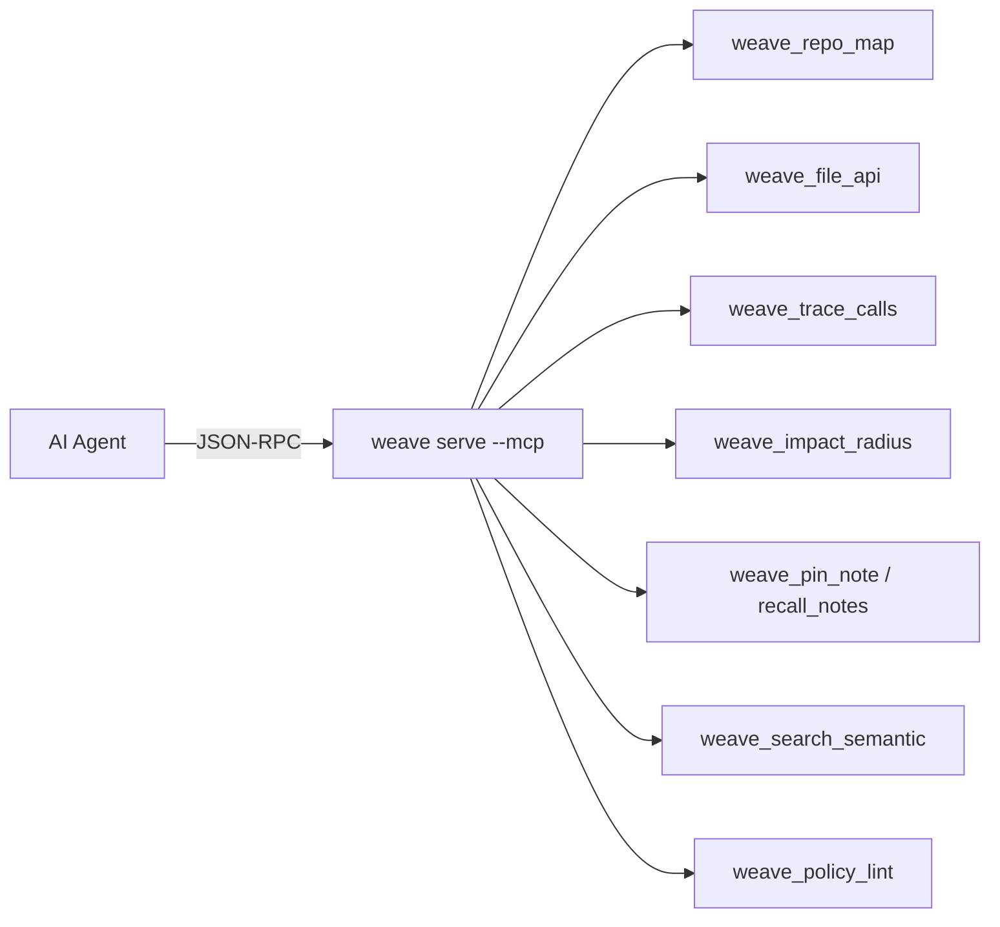
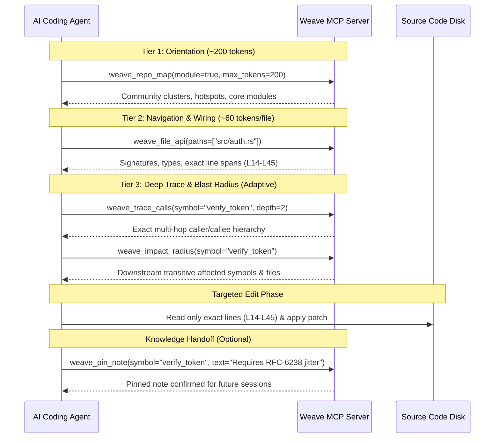
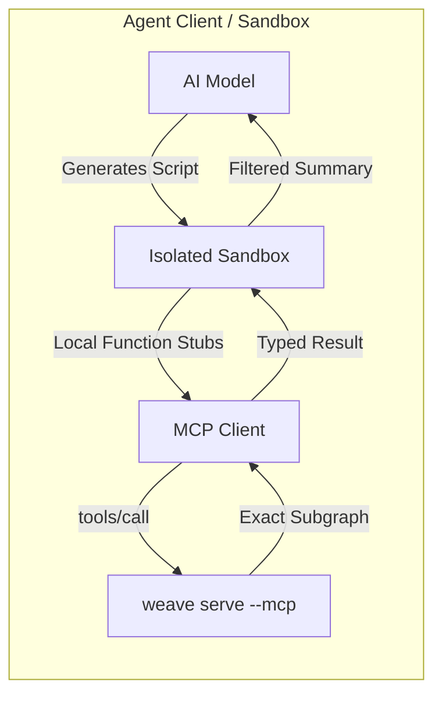
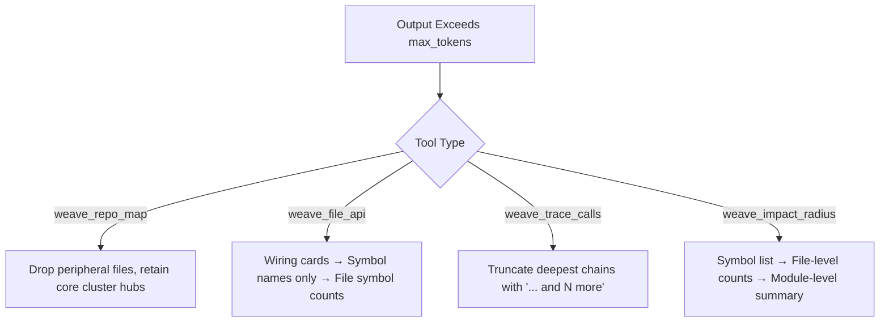

# Model Context Protocol (MCP) Integration

`weave serve --mcp` implements the [Model Context Protocol (MCP)](https://modelcontextprotocol.io/) specification (version `2024-11-05`), exposing the indexed code intelligence graph directly to AI coding agents (Claude Desktop, Claude Code, Cursor, Windsurf, Zed, Continue, Copilot).

Unlike agent plugins that invoke external LLMs or third-party web services, `weave` executes **100% deterministically and offline**: tool queries are answered in microseconds directly from the on-disk SQLite database (`.weave/graph.db`) and in-memory CSR adjacency matrix.

---

## 1. Quick Start

### Start via Stdio (Standard for AI Agents)
```bash
weave serve --mcp
```

### Start via Loopback HTTP Transport
```bash
weave serve --mcp --transport http --host 127.0.0.1 --port 8080
```

> [!IMPORTANT]
> **Core Invariant: Loopback Binding Only**  
> `weave serve --mcp` binds `127.0.0.1` by default. Binding to `0.0.0.0` or any non-loopback address requires the explicit `--allow-remote` flag. Because the graph exposes full repository AST and call hierarchy structures, binding beyond loopback on an untrusted or shared network is unsafe.

### Global CLI Flags for `serve`

| Flag | Default | Purpose |
| :--- | :--- | :--- |
| `--mcp` | *(Required)* | Enables the Model Context Protocol server. |
| `--transport <mode>` | `stdio` | Transport protocol: `stdio` or `http`. |
| `--host <ip>` | `127.0.0.1` | Bind address for HTTP transport (loopback only by default). |
| `--port <port>` | `8080` | Port for HTTP transport. |
| `--allow-remote` | `false` | Explicit opt-in required to bind non-loopback interfaces. |
| `--as <subject>` | *(Anonymous)* | Binds the entire session to a specific RBAC identity (`--features rbac`). |
| `--require-as` | `false` | Refuses to start the server if `--as` is omitted (`--features rbac`). Same effect as `[rbac] require_identity = true` in `.weave/config.toml` — set either for a shared/multi-tenant deployment where an unmasked session by omission is unacceptable. |

---

## 2. Client Configurations

MCP clients speak JSON-RPC 2.0 over standard I/O (`stdio`). `weave serve` automatically runs against the current working directory (`cwd`), requiring that the target repository has already been initialized (`weave init`) and indexed (`weave index`).

### Claude Desktop
Add to `~/Library/Application Support/Claude/claude_desktop_config.json` (macOS) or `%APPDATA%\Claude\claude_desktop_config.json` (Windows):

```json
{
  "mcpServers": {
    "weave": {
      "command": "/usr/local/bin/weave",
      "args": ["serve", "--mcp"],
      "cwd": "/path/to/your/project"
    }
  }
}
```

### Claude Code
Add to `.mcp.json` at the root of your project:

```json
{
  "mcpServers": {
    "weave": {
      "command": "weave",
      "args": ["serve", "--mcp"]
    }
  }
}
```

### Cursor
Add to `.cursor/mcp.json` in your project or global Cursor settings:

```json
{
  "mcpServers": {
    "weave": {
      "command": "weave",
      "args": ["serve", "--mcp"]
    }
  }
}
```

### Windsurf
Add to `~/.codeium/windsurf/mcp_config.json`:

```json
{
  "mcpServers": {
    "weave": {
      "command": "weave",
      "args": ["serve", "--mcp"],
      "cwd": "/path/to/your/project"
    }
  }
}
```

### Zed
Add to your Zed `settings.json`:

```json
{
  "context_servers": {
    "weave": {
      "command": {
        "path": "weave",
        "args": ["serve", "--mcp"]
      }
    }
  }
}
```

### With RBAC Role Enforcement
To bind the agent session to a non-`internal` identity (sees only `pub`-visible symbols; see §9 for the visibility model):

```json
{
  "mcpServers": {
    "weave": {
      "command": "weave",
      "args": ["serve", "--mcp", "--as", "contractor-bot"],
      "cwd": "/path/to/your/project"
    }
  }
}
```

---

## 3. Tool Specifications

When initialized, `weave serve --mcp` advertises **4 base tools**, plus one more per optional feature compiled in: **+2** with `--features notes` (`weave_pin_note`/`weave_recall_notes`), **+1** with `--features vector` (`weave_search_semantic`), **+1** with `--features policy-lint` (`weave_policy_lint`) — up to **8 tools** with all three enabled (`--features custom,notes`; the `custom` bundle itself includes `vector` and `policy-lint` but not `notes`, so `--features custom` alone advertises 6).



### Tool Inventory

| Tool | Profile / Tier | Purpose | Token Cost |
| :--- | :--- | :--- | :--- |
| `weave_repo_map` | Base | Progressive architectural orientation of top modules. | ~200 tokens |
| `weave_file_api` | Base | Micro wiring cards of requested source files. | ~60 tokens/file |
| `weave_trace_calls` | Base | Multi-hop inbound and outbound call chain traversal. | Adaptive |
| `weave_impact_radius`| Base | Transitive topological blast radius of code edits. | Adaptive |
| `weave_pin_note` | Knowledge (`notes`) | Pin persistent or ephemeral architectural context. | Low |
| `weave_recall_notes` | Knowledge (`notes`) | Retrieve live pinned notes (expired notes filtered). | Low |
| `weave_search_semantic` | Search (`vector`) | Binary-ANN-then-int8-rerank semantic search over AST-bounded chunks. | Adaptive |
| `weave_policy_lint` | Governance (`policy-lint`) | Evaluates `.weave/policy.yaml` architectural boundary rules against the indexed graph. | Adaptive |

---

### Detailed Tool Schemas

#### 1. `weave_repo_map`
Orient the agent with high-level repository architecture.
- **Parameters**:
  - `max_files` *(integer, optional, default: 50)*: Maximum number of files to include.
  - `module` *(boolean, optional, default: false)*: When `true`, returns a Louvain community-detection module view (label, symbol count, cross-edges, member files) rather than flat file paths.
  - `max_tokens` *(integer, optional)*: Hard token-estimate ceiling. Progressively drops less significant files until output fits.
- **RBAC Masking**: masked files (see §9) collapse into one aggregate `<rbac: hidden>` bucket instead of naming real paths.

#### 2. `weave_file_api`
Returns micro wiring cards containing symbol declarations, spans, and signatures without exposing full implementation bodies.
- **Parameters**:
  - `paths` *(array of strings, **required**)*: Relative file paths to inspect (e.g., `["src/auth.rs", "src/models.rs"]`).
  - `max_tokens` *(integer, optional)*: Sheds detail in tiers (full wiring cards → symbol names only → file counts) if the budget is exceeded.
- **RBAC Masking**: masked symbols (see §9) render as `<rbac: hidden>` with a zeroed `L0-0` span and empty signature; the file's real symbol count is preserved.

#### 3. `weave_trace_calls`
Traces callers (incoming) and callees (outgoing) up to `depth` hops.
- **Parameters**:
  - `symbol` *(string, **required**)*: The symbol identifier to traverse (e.g. `AuthService.verify`).
  - `depth` *(integer, optional, default: 2)*: Traversal hop depth.
  - `max_tokens` *(integer, optional)*: Truncates chains with explicit `"... and N more"` markers if budget is exceeded.
- **RBAC Masking**: masked nodes show as `<rbac: hidden>` (symbol, kind, path) with zero source spans or signatures leaked.

#### 4. `weave_impact_radius`
Calculates the full blast radius of a change, determining every downstream symbol, file, and module affected by modifying `symbol`.
- **Parameters**:
  - `symbol` *(string, **required**)*: Target symbol being altered or refactored.
  - `max_tokens` *(integer, optional)*: Sheds detail dynamically: full symbol list → file-level summary → module-level summary.
- **RBAC Masking**: same as `weave_trace_calls` — masked nodes show as `<rbac: hidden>` with zero source spans or signatures leaked; the root symbol itself always resolves by name so the query stays answerable.

#### 5. `weave_pin_note` *(Feature: `notes`)*
Leaves architectural hints, invariants, or refactoring warnings for future agent sessions.
- **Parameters**:
  - `symbol` *(string, **required**)*: Target symbol name.
  - `text` *(string, **required**)*: Note body explaining rationale or constraints.
  - `tier` *(string, optional, default: `"ephemeral"`)*: `"ephemeral"` (24-hour TTL) or `"crystallized"` (persisted permanently).
  - `kind` *(string, optional, default: `"note"`)*: Categorical tag (e.g. `"arch_decision"`, `"invariant"`, `"debt"`).

#### 6. `weave_recall_notes` *(Feature: `notes`)*
Reads all active notes pinned to symbols across the workspace. Expired ephemeral notes are automatically excluded, and notes whose target symbols were deleted are flagged as orphaned.

#### 7. `weave_search_semantic` *(Feature: `vector`)*
Binary-ANN-then-int8-rerank semantic search over AST-bounded source chunks, using the same reference embedding provider as `weave search --semantic`.
- **Parameters**:
  - `query` *(string, **required**)*: Natural-language or code-shaped search query.
  - `limit` *(integer, optional, default: 5)*: Max hits to return.
- **RBAC Masking**: the visibility filter is applied to reranked candidates *before* the `limit` cap, not after — a masked top hit can never starve a visible runner-up out of the result set.

#### 8. `weave_policy_lint` *(Feature: `policy-lint`)*
Evaluates the boundary rules declared in `.weave/policy.yaml` against the currently indexed graph — the same rule model and evaluation `weave policy lint` uses, exposed as an MCP tool.
- **Parameters**: none.
- **RBAC Masking**: nodes/edges are filtered through the session's bound identity first; a restricted identity's clean result means "no violations *it* could see," not a repo-wide compliance guarantee (the same caveat `weave policy lint --as <subject>` carries).

---

## 4. Progressive Tool Calling Workflow (3-Tier Context Architecture)

In modern AI agent architectures, passing full source files or dumping whole-repo JSON trees into context leads to high token costs, increased latency, and model hallucinations (*"lost in the middle"*). 

Following official **MCP Client & Server Best Practices**, `weave serve --mcp` implements a **3-Tier Progressive Disclosure** tool calling model. Agents retrieve context incrementally on demand:



### The 4 Phases of Progressive Progression

1. **Phase 1: Orientation (Tier 1 — `weave_repo_map`)**
   - **Agent Question**: *"Where does code live in this project, and how are modules structured?"*
   - **Action**: Call `weave_repo_map` with `module: true` or `max_tokens: 200`.
   - **Cost**: ~200 tokens (vs. 15,000+ tokens for full directory tree walks).
   - **Result**: Identifies key Louvain communities, entry points, and central hub files.

2. **Phase 2: Navigation & Wiring (Tier 2 — `weave_file_api`)**
   - **Agent Question**: *"What functions and types exist in candidate files, and where are they located?"*
   - **Action**: Call `weave_file_api(paths: ["src/auth.rs", ...])`.
   - **Cost**: ~60 tokens per file (vs. 2,000–5,000 tokens for full file contents).
   - **Result**: Compact wiring cards with function signatures and exact `L{start}-{end}` line spans without leaking internal function bodies into context.

3. **Phase 3: Traversal & Blast Radius (Tier 3 — `weave_trace_calls` & `weave_impact_radius`)**
   - **Agent Question**: *"Who calls this function, and what will break if I modify it?"*
   - **Action**: Call `weave_trace_calls` for upstream/downstream chains, and `weave_impact_radius` to calculate transitive impact before editing.
   - **Cost**: Adaptive (~100 tokens), bounded by `max_tokens`.
   - **Result**: Concrete multi-hop calling paths and topological blast radius across all files and workspaces.

4. **Phase 4: Knowledge Handoff (`weave_pin_note` / `weave_recall_notes`)**
   - **Agent Question**: *"Are there architectural decisions or caveats about this code?"*
   - **Action**: Call `weave_recall_notes` on entry; call `weave_pin_note` to record key rationale or warnings for subsequent agent sessions.

---

### Token Economy: Direct File Dumps vs. Progressive MCP Tool Calling

| Metric | Traditional Whole-File Context Dump | Weave Progressive MCP Tool Calling | Savings |
| :--- | :--- | :--- | :--- |
| **Initial Discovery** | 20,000 – 60,000 tokens | ~200 tokens (`weave_repo_map`) | **99%** |
| **File API Inspection** | 4,000 – 10,000 tokens / file | ~60 tokens / file (`weave_file_api`) | **98%** |
| **Call Graph Discovery** | Multi-file regex grep (~15k tokens) | ~100 tokens (`weave_trace_calls`) | **93%** |
| **Total Task Context** | 50,000 – 120,000 tokens | **< 800 tokens total** | **92%+** |
| **Accuracy / Hallucination** | Frequent *"lost in the middle"* errors | Exact AST-grounded spans & symbol names | **100% Grounded** |

---

### Recommended Agent System Directive (`CLAUDE.md` / `.cursorrules`)

Add this prompt rule to your AI coding agent configuration (`CLAUDE.md`, `.cursorrules`, `.windsurfrules`, or custom instructions) to enforce progressive tool calling:

```markdown
### MCP Tool Calling Progression Rule
When analyzing or editing code in this workspace, ALWAYS follow the progressive 3-tier MCP tool sequence before reading raw files:
1. Orient: Call `weave_repo_map` to locate relevant module clusters.
2. Inspect: Call `weave_file_api` with candidate file paths to inspect symbol signatures and line spans (`L{start}-{end}`).
3. Trace: Call `weave_trace_calls` and `weave_impact_radius` to determine callers and blast radius before modifying any symbol.
4. Read: Open only the exact `L{start}-{end}` line range indicated by `weave_file_api` — NEVER dump entire source files into context.
```

---

## 5. Programmatic Tool Calling ("Code Mode") Compatibility

As outlined in official MCP client best practices, advanced agents can execute **Programmatic Tool Calling** ("Code Mode"): rather than sending multiple separate round trips where intermediate graph results flow through the LLM context, the agent writes a concise script executed within a secure sandbox (e.g., Deno, V8, Node.js, or Wasmtime).

`weave serve --mcp` tools are designed for seamless programmatic composition:



### Example: Programmatic Multi-Hop Impact Audit

An agent auditing a refactor can compose tool calls programmatically inside its execution sandbox:

```typescript
// Executed in agent sandbox without polluting LLM context with intermediate raw graphs:
import { weave_file_api, weave_trace_calls, weave_impact_radius } from "mcp:weave";

// 1. Inspect wiring card
const cards = await weave_file_api({ paths: ["crates/weave-graph-core/src/csr.rs"] });

// 2. Trace impact of specific methods
const blast = await weave_impact_radius({ symbol: "Csr.neighbors_slice" });

// 3. Filter high-priority callers inside sandbox
const callers = await weave_trace_calls({ symbol: "Csr.neighbors_slice", depth: 2 });

// 4. Return only the concise synthesized crux to the model
console.log(`Refactoring Csr.neighbors_slice affects ${blast.symbol_count} symbols across ${cards.length} files.`);
```

By filtering and aggregating in the sandbox, only a ~20-token summary enters the model's context window instead of thousands of lines of intermediate JSON graph traversals.

---

## 6. Token Budgeting & Tiered Shedding

To prevent AI context window exhaustion, all structural tools support an optional `max_tokens` parameter. Instead of failing or truncating abruptly mid-JSON, tools execute **tiered shedding**:



When `max_tokens` is omitted, the tools return standard complete outputs without shedding.

---

## 7. Live Reloading & Crash-Resilient Concurrency

An AI coding session often stays active for hours while files are modified, branched, or reindexed by background jobs. `weave serve --mcp` handles external state changes transparently:

### Atomic Database Swap Detection
1. When `weave index` runs concurrently, it writes to a temporary file (`.weave/graph.db.rebuild`) and atomically moves it over `.weave/graph.db` using `rename(2)`.
2. The MCP handler performs a rate-limited `stat()` check on `.weave/graph.db` (debounced to 500ms).
3. If the database inode or modification time (`mtime`) changes, the server **fully closes and reopens** its SQLite handle and reconstructs the in-memory CSR matrix.
4. Active agent queries never lock, read partial data, or panic.

### Network Filesystem Resilience
If the workspace database is hosted on a shared network mount (detected or configured via `WEAVE_HOME`), the server automatically initializes SQLite in **non-WAL shared snapshot mode**, avoiding SQLite WAL shared-memory locking failures on NFS/SMB.

---

## 8. Background Watcher & Staleness Markers

When the binary is compiled with the `watch` feature and `[watch] enabled = true` is configured in `.weave/config.toml`, `weave serve --mcp` spawns a non-blocking background file watcher.

If files are modified while the agent is running:
- **Pending manual reindex notice**: If a code change exceeds the automated blast-radius safety threshold, tools append an additive notice:
  ```text
  ⚠️ 42 symbols' worth of blast radius pending — run `weave index` to refresh (3 file(s): src/auth.rs, src/db.rs, src/main.rs)
  ```
- **Debounce in-flight notice**: If files were modified within the debounce window:
  ```text
  ℹ️ 1 file(s) just changed, not yet reindexed (still inside the debounce window): src/token.rs
  ```

These markers are purely informative and never block or invalidate tool output.

---

## 9. RBAC Query-Layer Masking

In enterprise repositories with multi-team or external contractor access, `weave serve --mcp --as <subject>` enforces role-based access control inside the graph traversal engine — the same `RbacGuard` `weave query`/`weave report`/`weave export` share (`impl.md` M3.0), so nothing an agent asks over MCP sees more than the CLI would for the same identity.

```toml
# .weave/config.toml
[rbac.users]
"alice" = ["internal"]
"contractor-bot" = ["contractor"]
```

The visibility model is deliberately a single binary split, not a per-role rule engine:
- **`"internal"` is the one role name this crate treats specially** — any identity holding it bypasses masking entirely and sees the full graph. This is a fixed sentinel, not a configurable pattern.
- **Every other role (or no role — an unconfigured/anonymous subject)** sees only symbols the language's own visibility convention marks public (`pub fn` in Rust, `export` in TS/JS, the same per-language rule `weave check-contracts`'s M2.2 contract hash already uses) — masking is *not* configured per role, per module, or per glob pattern. `"contractor"` and `"auditor"` and any other role name all get the identical masked view; the role's own name only matters for other systems (SCIM group mapping, audit logs), not for what gets hidden here.

When a non-`internal` identity calls any of the four base tools:
- `weave_trace_calls` / `weave_impact_radius`: masked nodes appear as `<rbac: hidden>` in place of symbol, path, and kind; line numbers zero out and the signature is empty.
- `weave_file_api`: masked files still report their real symbol *count*, but each masked symbol's name, kind, span, and signature render as `<rbac: hidden>` / `L0-0` — never silently dropped, so a caller can tell "nothing here" from "something here I can't see."
- `weave_repo_map`: every masked file collapses into one aggregate `<rbac: hidden>` bucket (summed symbol/edge counts) rather than leaking per-file structure for paths the identity can't see; module-level mode folds the same masked files into one module entry.

The two optional tools follow the same guard, with their own shape:
- `weave_search_semantic` (feature `vector`): masked candidates are dropped, not redacted — filtered out of the reranked result *before* the `limit` cap, so a masked top hit never displaces a visible runner-up from a size-limited response.
- `weave_policy_lint` (feature `policy-lint`): masked nodes and any edge touching one are dropped from the graph before linting; a clean result under a restricted identity only means "no violations that identity could see," never a repo-wide guarantee (the same caveat `weave policy lint --as <subject>` carries at the CLI).

Because masking is enforced inside `weave-graph-core`'s traversal engine — applied once to the whole node list before any tool renders its response — rather than as an export-time filter, an agent cannot bypass security rules through graph hops or by picking a different tool.

---

## 10. Alignment with Latest MCP Specification & Design Best Practices

`weave serve --mcp` strictly conforms to the core principles defined by the Model Context Protocol:

| MCP Design Best Practice | Weave Graph Implementation |
| :--- | :--- |
| **Progressive Tool Discovery** | Implements the 3-tier catalog-inspect-execute pattern (`repo_map` → `file_api` → `trace_calls`) to avoid upfront context window bloat. |
| **Prompt Cache Optimization** | Emits `tools/list` with deterministic ordering and stable schemas to maximize Anthropic and OpenAI prompt prefix cache hit rates (>90%). |
| **Actionable Tool Errors** | Failed lookups (`weave_trace_calls`, `weave_impact_radius`, `weave_repo_map`) return `isError: true` with a `"symbol not found: <name>"` / `"error: ..."` content block, so an agent can tell "nothing matched" from a normal success at the envelope level. **Known gap**: no fuzzy-matched candidate suggestions yet — the error names what didn't resolve, not what might have been meant. Tracked as follow-on work. |
| **Read-Only / Idempotent Queries** | All structural traversal tools (`repo_map`, `file_api`, `trace_calls`, `impact_radius`) are side-effect free and idempotent, ensuring safe execution in autonomous loops. |
| **Programmatic Composition ("Code Mode")** | Returns compact structured outputs with line spans (`L{start}-{end}`) suitable for direct consumption by agent sandboxes without round-tripping intermediate payloads. |
| **Loopback Security Boundary** | Binds exclusively to `127.0.0.1` by default, safeguarding AST code intelligence from accidental LAN or cloud exposure. |

---

## 11. Verifying the MCP Server Locally

You can test `weave serve --mcp` directly from the command line using standard JSON-RPC inputs:

### Test Initialize
```bash
echo '{"jsonrpc":"2.0","id":1,"method":"initialize","params":{"protocolVersion":"2024-11-05"}}' | weave serve --mcp
```
**Expected Response:**
```json
{"jsonrpc":"2.0","id":1,"result":{"capabilities":{"tools":{}},"protocolVersion":"2024-11-05","serverInfo":{"name":"weave","version":"0.1.0"}}}
```

### Test Tools List
```bash
echo '{"jsonrpc":"2.0","id":2,"method":"tools/list"}' | weave serve --mcp
```
**Expected Response:** A JSON object containing the tool schemas for `weave_repo_map`, `weave_file_api`, `weave_trace_calls`, and `weave_impact_radius`.

### Test Calling `weave_repo_map`
```bash
echo '{"jsonrpc":"2.0","id":3,"method":"tools/call","params":{"name":"weave_repo_map","arguments":{"max_files":5}}}' | weave serve --mcp
```
