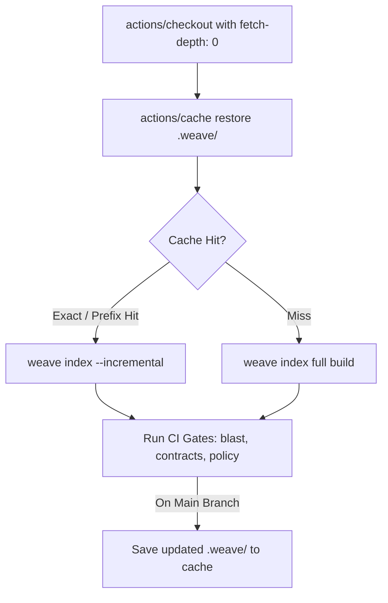
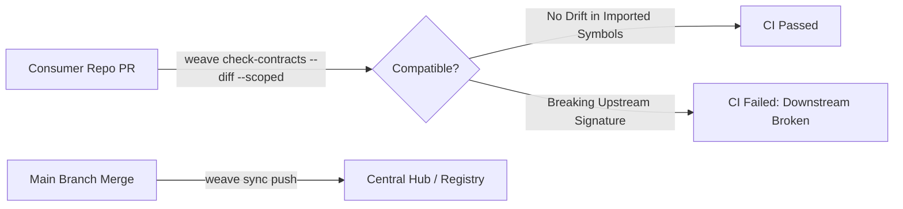

# GitHub Actions & CI/CD Pipeline Integration

Integrating `weave` into GitHub Actions provides deterministic graph and
contract checks without network or LLM dependencies. Actual CI duration depends
on repository size, cache state, and runner hardware; no universal millisecond
claim is made here.

This guide provides tested GitHub Actions workflow recipes and configuration strategies for:
1. **Single Mode (`mode = "single"`)**: PR blast-radius commenting, contract diffing, and health reporting for monorepos and standalone services.
2. **Multiple Mode (`mode = "multiple"`)**: Cross-repository boundary contract verification and centralized snapshot synchronization.
3. **Custom / Enterprise Mode (`--features custom`)**: Architectural boundary enforcement (`policy.yaml`), cycle detection, OTLP trace validation, and RBAC-sanitized exports.

---

## 1. Core CI Invariants & Caching Architecture

### The L1 Graph Cache
Building the full graph from scratch on every commit costs real wall-clock time at scale (extraction throughput is ~4 MiB/s per core); incremental indexing on top of a cached graph re-parses only the changed files, which is why caching `.weave/` between runs matters for CI. 



### Critical Setup Rules

> [!IMPORTANT]
> **1. Checkout Depth Must Be 0 (`fetch-depth: 0`)**  
> Both incremental indexing (`weave index --incremental`) and PR blast-radius calculations (`weave blast --base origin/main`) rely on `git merge-base` to find common ancestors. The default `fetch-depth: 1` performs a shallow clone without merge history, causing diff detection to fail.
>
> **2. Prefix-Fallback Cache Keys**  
> An exact SHA cache key never hits on a new pull request branch. Use prefix fallback keys (`weave-${{ runner.os }}-${{ github.ref_name }}-` and `weave-${{ runner.os }}-main-`) so the job restores the latest graph and only parses changed files.

---

## 2. Single Mode Workflows (`mode = "single"`)

In single-repository mode, `weave` acts as a PR assistant and architecture gate:
- Computes the **topological blast radius** of the PR diff (which downstream functions, services, or endpoints are impacted).
- Emits formatted Markdown directly into a PR comment.
- Validates that internal contracts have not diverged.

### Complete Workflow: `.github/workflows/weave-single.yml`

```yaml
name: Weave Code Intelligence

on:
  pull_request:
    branches: [main]
  push:
    branches: [main]

permissions:
  contents: read
  pull-requests: write

jobs:
  weave-gate:
    runs-on: ubuntu-latest
    steps:
      - name: Checkout repository
        uses: actions/checkout@v4
        with:
          fetch-depth: 0

      - name: Install Weave Graph
        run: |
          curl -fsSL https://raw.githubusercontent.com/ragubaran/weave-graph/main/install.sh | sh
          echo "$HOME/.local/bin" >> $GITHUB_PATH

      - name: Restore Weave Graph Cache
        id: weave-cache
        uses: actions/cache@v4
        with:
          path: .weave/
          key: weave-${{ runner.os }}-${{ github.ref_name }}-${{ github.sha }}
          restore-keys: |
            weave-${{ runner.os }}-${{ github.ref_name }}-
            weave-${{ runner.os }}-main-

      - name: Index Codebase
        run: |
          if [ -d ".weave" ]; then
            weave index --incremental
          else
            weave init --mode single
            weave index
          fi

      - name: Check Contract Drift
        run: |
          # Fails with non-zero exit code if exported symbols broke contract
          weave check-contracts --diff

      - name: Compute PR Blast Radius
        if: github.event_name == 'pull_request'
        run: |
          weave blast \
            --base origin/main \
            --depth 2 \
            --direction callers \
            --format md \
            --out pr-blast.md

      - name: Post PR Blast Radius Comment
        if: github.event_name == 'pull_request'
        uses: actions/github-script@v7
        with:
          github-token: ${{ secrets.GITHUB_TOKEN }}
          script: |
            const fs = require('fs');
            if (!fs.existsSync('pr-blast.md')) return;
            const body = fs.readFileSync('pr-blast.md', 'utf8');
            if (!body.trim()) return;

            const marker = '<!-- weave-blast-comment -->';
            const { data: comments } = await github.rest.issues.listComments({
              owner: context.repo.owner,
              repo: context.repo.repo,
              issue_number: context.issue.number,
            });

            const botComment = comments.find(c => c.body.includes(marker));
            const fullBody = `${marker}\n### 🕸️ Weave Blast Radius Analysis\n\n${body}`;

            if (botComment) {
              await github.rest.issues.updateComment({
                owner: context.repo.owner,
                repo: context.repo.repo,
                comment_id: botComment.id,
                body: fullBody
              });
            } else {
              await github.rest.issues.createComment({
                owner: context.repo.owner,
                repo: context.repo.repo,
                issue_number: context.issue.number,
                body: fullBody
              });
            }
```

---

## 3. Multiple Mode Workflows (`mode = "multiple"`)

In federated architectures with multiple microservices or upstream libraries, `weave` tracks cross-repository dependencies and detects breaking contract changes before deployment.



### Consumer-Side Contract Gate: `.github/workflows/weave-federated.yml`

This workflow links upstream provider repositories and validates that the consumer's code only breaks when an API it **actually imports** changes (`--scoped` flag):

```yaml
name: Weave Federated Contract Gate

on:
  pull_request:
    branches: [main]
  push:
    branches: [main]

jobs:
  check-federation:
    runs-on: ubuntu-latest
    steps:
      - name: Checkout Consumer Repository
        uses: actions/checkout@v4
        with:
          path: service-consumer
          fetch-depth: 0

      - name: Checkout Upstream Service Provider
        uses: actions/checkout@v4
        with:
          repository: my-org/service-auth
          path: service-auth
          token: ${{ secrets.CI_BOT_TOKEN }}
          fetch-depth: 1

      - name: Install Weave Graph
        run: |
          curl -fsSL https://raw.githubusercontent.com/ragubaran/weave-graph/main/install.sh | sh
          echo "$HOME/.local/bin" >> $GITHUB_PATH

      - name: Link & Index Federation
        run: |
          cd service-consumer
          weave init --mode multiple
          weave link auth ../service-auth
          weave index

      - name: Verify Scoped Contracts
        run: |
          cd service-consumer
          # --scoped: Only fail if symbols service-consumer consumes were modified/removed
          weave check-contracts --diff --scoped
```

### Upstream Provider Hub Publishing: `.github/workflows/weave-hub-sync.yml`

When an upstream service merges to `main`, it publishes its updated graph snapshot to the centralized Weave Hub or Registry:

```yaml
name: Publish Graph Snapshot to Hub

on:
  push:
    branches: [main]

jobs:
  publish-snapshot:
    runs-on: ubuntu-latest
    steps:
      - name: Checkout repository
        uses: actions/checkout@v4
        with:
          fetch-depth: 0

      - name: Install Weave Graph (Team Profile)
        run: |
          cargo install weave-graph-cli --features team

      - name: Build Graph Index
        run: |
          weave init --mode multiple
          weave config set hub.url "${{ vars.WEAVE_HUB_URL }}"
          weave index

      - name: Push Snapshot to Hub
        run: |
          # `weave sync` (M3.1) has no built-in auth — v1's threat model is
          # a self-hosted hub on a trusted VPC/LAN, so there is no
          # WEAVE_HUB_TOKEN to set here. If your deployment signs snapshots
          # (`weave-graph-hub`'s `hub-provenance` feature), compute the
          # signature in a prior step and pass it through explicitly:
          #   weave sync push --signature "$SNAPSHOT_SIGNATURE"
          weave sync push
```

### Auto-Publish Architecture Canvas to an Obsidian Vault: `.github/workflows/weave-obsidian-sync.yml`

If your self-hosted `weave-registry` was built with the `hub-canvas` feature
(`cargo build -p weave-graph-hub --bin weave-registry --features hub-canvas`),
it serves the just-published snapshot's module map as a
[JSON Canvas](https://jsoncanvas.org) document at
`GET /repos/{repo_id}/canvas` — no `weave` binary needed to read it, just
`curl`. This job runs after the hub-sync job above and drops that file
straight into a separate Obsidian vault repo, so the vault always reflects
the latest merged architecture with zero manual export:

```yaml
name: Publish Architecture Canvas to Obsidian Vault

on:
  push:
    branches: [main]

jobs:
  publish-canvas:
    runs-on: ubuntu-latest
    steps:
      - name: Fetch the latest architecture canvas from the hub
        run: |
          curl -fsSL "${{ vars.WEAVE_HUB_URL }}/repos/${{ github.event.repository.name }}/canvas" \
            -o architecture.canvas

      - name: Checkout the Obsidian vault repository
        uses: actions/checkout@v4
        with:
          repository: your-org/architecture-vault
          token: ${{ secrets.VAULT_PUSH_TOKEN }}
          path: vault

      - name: Commit the updated canvas
        run: |
          mkdir -p "vault/architecture"
          cp architecture.canvas "vault/architecture/${{ github.event.repository.name }}.canvas"
          cd vault
          git config user.name "weave-graph-bot"
          git config user.email "noreply@weave.dev"
          git add "architecture/${{ github.event.repository.name }}.canvas"
          git diff --cached --quiet || git commit -m "Update ${{ github.event.repository.name }} architecture canvas"
          git push
```

This job has no `weave` install step at all — fetching the canvas is a
plain HTTP `GET`, and publishing it is a plain `git commit`/`push`. The
canvas endpoint is v1 scope: LOD 1 (module-level) only, one repo per call
— run the job once per repo that publishes to the hub, or loop over your
`[federation] linked_repos` list to fan it out.

---

## 4. Custom / Enterprise Mode Workflows (`--features custom`)

The Enterprise build (`--features custom`) introduces strict governance tools:
1. **`weave policy lint`**: Enforces architectural boundaries defined in `.weave/policy.yaml` (e.g. preventing domain layers from importing web controllers).
2. **`weave policy drift`**: Reports (advisory, never CI-failing) dependency cycles and orphaned files with no inbound cross-file dependency.
3. **`weave traces import`**: Ingests OTLP JSON traces to surface performance anomalies and high-latency call paths during PR review.
4. **`weave export --as <subject>`**: Generates sanitized graph exports respecting RBAC rules.

### Enterprise Governance Pipeline: `.github/workflows/weave-enterprise.yml`

```yaml
name: Enterprise Architecture & Policy Gate

on:
  pull_request:
    branches: [main]
  push:
    branches: [main]

jobs:
  architecture-governance:
    runs-on: ubuntu-latest
    steps:
      - name: Checkout Code
        uses: actions/checkout@v4
        with:
          fetch-depth: 0

      - name: Install Weave (Enterprise Custom Profile)
        run: |
          cargo install weave-graph-cli --features custom

      - name: Restore Index Cache
        uses: actions/cache@v4
        with:
          path: .weave/
          key: weave-ent-${{ runner.os }}-${{ github.ref_name }}-${{ github.sha }}
          restore-keys: |
            weave-ent-${{ runner.os }}-${{ github.ref_name }}-
            weave-ent-${{ runner.os }}-main-

      - name: Index Graph
        run: |
          if [ -d ".weave" ]; then
            weave index --incremental
          else
            weave init --mode single
            weave index
          fi

      - name: Lint Architecture Boundaries
        run: |
          # Evaluates .weave/policy.yaml; non-zero exit code on forbidden cross-module edges
          weave policy lint

      - name: Check Architectural Drift & Cycles
        run: |
          # Always advisory — weave policy drift never fails the build, it
          # only reports dependency cycles and orphaned files (no inbound
          # cross-file dependency) to stdout.
          weave policy drift

      - name: Validate Telemetry Traces (Optional)
        if: hashFiles('.weave/traces/latest.json') != ''
        run: |
          weave traces import .weave/traces/latest.json

      - name: Export Sanitized Compliance Graph
        if: github.ref == 'refs/heads/main'
        run: |
          # weave export always emits JSON, and always needs a root --symbol
          # to export the neighborhood of (it's not a whole-graph dump) —
          # --as applies the same RBAC masking every other command does.
          weave --as compliance-auditor export \
            --symbol AppRoot.main \
            --depth 3 \
            > compliance-graph.json

      - name: Archive Compliance Artifact
        if: github.ref == 'refs/heads/main'
        uses: actions/upload-artifact@v4
        with:
          name: compliance-graph
          path: compliance-graph.json
          retention-days: 30
```

---

## 5. Sample Configuration Files

### 1. `.weave/config.toml` (CI Optimized)

This is the real config schema — every key below is actually read by the code (see the full [Configuration Reference](configuration.md) for the complete list). There is no `[index]` or `[policy]` config table, and `staleness_policy` only recognizes `"warn"`/`"strict"`/`"ignore"` (a `"strict"` value is what fails CI — anything else, including a typo, is silently non-blocking):

```toml
mode = "single"

[federation]
linked_repos = ["../auth-service"]
staleness_policy = "strict"       # Fail CI if a linked provider's contract hash drifted

[rbac.users]
ci-pipeline = ["internal"]        # "internal" is the one role that bypasses masking
```

### 2. `.weave/policy.yaml` (Boundary Rules)

The real, and only, schema `weave policy lint` parses — a flat list of `disallow`/`require` rules, each an unordered `from`/`to` path-prefix pair (module membership is prefix-matched, not glob-matched: `src/domain` covers `src/domain/anything`, never a sibling like `src/domain-utils`):

```yaml
rules:
  - disallow:
      from: "src/domain"
      to: "src/adapters"
  - disallow:
      from: "src/domain"
      to: "src/web"
  - disallow:
      from: "src/auth"
      to: "src/reporting"
```

> [!WARNING]
> A previous version of this example used an invented schema (`version`, `boundaries`, `forbidden_imports`, `invariants`) that `weave policy lint` doesn't parse. Because `rules` defaults to empty on any unrecognized top-level shape, that file would have silently loaded **zero active rules** instead of erroring — always verify with `weave policy lint` locally after editing `policy.yaml`.

---

## 6. Pipeline Command Matrix

| Command | CI Stage | Purpose | Exit Code Behavior |
| :--- | :--- | :--- | :--- |
| `weave init --mode <mode>` | Pre-Index | Initializes `.weave/` directory if absent. | `0` on success |
| `weave index --incremental` | Indexing | Reindexes modified files using cached SQLite base. | `0` on success |
| `weave check-contracts --diff` | Quality Gate | Computes symbol delta across boundaries. | Exits `1` on drift only under `staleness_policy = "strict"` (config-dependent, waivable — see below) |
| `weave check-contracts --scoped`| Quality Gate | Restricts contract failures to imported symbols only. | Same as above, only for the imported subset |
| `weave blast --base <ref>` | PR Review | Computes downstream blast radius of PR diff. | `0` (writes Markdown/JSON) |
| `weave policy lint` | Quality Gate | Enforces `.weave/policy.yaml` architectural rules. | Exits `1` on any boundary breach (unconditional, not config-gated) |
| `weave policy drift` | Quality Gate | Detects dependency cycles and orphaned files. | Always exits `0` — advisory only, never fails the build |
| `weave traces import <path>` | Observability | Ingests OTLP spans for runtime overlay. | `0` on valid JSON traces |
| `weave sync push` | Post-Merge | Uploads updated graph delta to central Hub. | `0` on upload confirmation |

Both `check-contracts` and `blast` support temporary, audited waivers (`--allow-drift`/`--allow-drift-for`/`--warn-only`/`--skip`, or the matching `WEAVE_SKIP_CONTRACTS`/`WEAVE_SKIP_BLAST`/`WEAVE_STALENESS_POLICY_OVERRIDE`/`WEAVE_ALLOW_DRIFT_REPOS` env vars) — see the [CLI Reference](cli-reference.md) for the full flag list. A waived gate exits `0` and prints a Waiver Notice, never silently.

---

## 7. Troubleshooting CI Workflows

### 1. Shallow Clone Merge-Base Errors
- **Symptom**: `weave blast` returns 0 affected symbols or reports `fatal: no common ancestor`.
- **Cause**: `actions/checkout` ran with default `fetch-depth: 1`.
- **Fix**: Set `fetch-depth: 0` in your workflow checkout step.

### 2. Cache Invalidation Loops
- **Symptom**: Cache misses on every commit despite matching branch names.
- **Cause**: Missing prefix-fallback keys in `restore-keys`.
- **Fix**: Include `weave-${{ runner.os }}-${{ github.ref_name }}-` and `weave-${{ runner.os }}-main-` under `restore-keys`.

### 3. False Positives in Multi-Repo Contract Checks
- **Symptom**: Provider changed an internal function, causing consumer CI to fail.
- **Cause**: Running `weave check-contracts --diff` without `--scoped`.
- **Fix**: Add `--scoped` so only symbols actually referenced by the consumer trigger CI failure.
