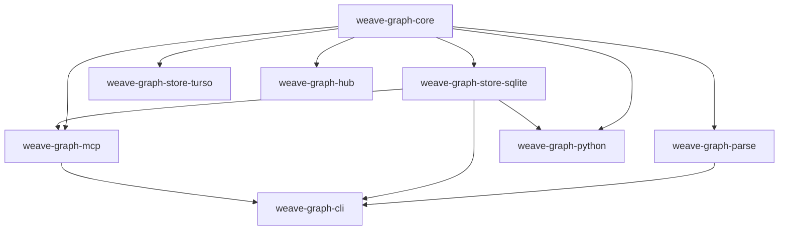

# Multi-Channel Release & Automation Specification (`release.md`)

> **Document ID**: `release.md`  
> **Topic**: Production Release Plan & CI/CD Pipeline Automation for Homebrew, Crates.io, npm/npx, and PyPI  
> **Target Binaries**: `weave` (CLI: standalone stripped executable <15MB, idle RAM <80MB, zero runtime dependencies)  
> **Crates**: `weave-graph-*` (7 library crates + 1 CLI crate)  
> **Packages**: Homebrew (`weave`), Crates.io (`weave-graph-*`), npm (`@weave-graph/cli`), PyPI (`weave-graph`)
> **`v1.0.1` maturity release target**: **10 October 2026**. Until the tag,
> artifacts, and checksums are published, references to `1.0.1` in this
> specification describe the target release rather than an available release.

---

## 1. Release Strategy Overview

`weave-graph` distributes across four primary package ecosystems to serve different consumer profiles without compromising core architectural invariants (deterministic zero-network base tier, memory compaction, and feature isolation):

| Channel | Target Audience | Distribution Mechanism | Artifact Type |
| :--- | :--- | :--- | :--- |
| **Homebrew (`brew`)** | macOS & Linux terminal users | Git tap (`weave-graph/homebrew-tap`) | Pre-compiled native binary tarballs with SHA-256 verification |
| **Cargo (`crate`)** | Rust developers, embedded tools | crates.io registry | Source crates published in strict topological dependency order |
| **npm / npx (`npx`)** | AI agent hosts, Node.js tooling | npm registry (`@weave-graph/cli`) | Platform-specific native binary packages + zero-install wrapper |
| **PyPI (`pypi`)** | Python / Data Science pipelines | PyPI registry (`weave-graph`) | CPython ABI3 / Maturin native wheels + source distribution (`sdist`) |

### Standard Pre-Release Invariants
Before triggering any release pipeline, the following conditions must be asserted:
1. **Pre-flight verification**: `cargo fmt --check`, `cargo clippy --workspace --all-targets --all-features -- -D warnings`, and `cargo test --workspace --all-features --exclude weave-graph-python` must pass with zero warnings or failures.
2. **Coverage Gate**: Code line coverage must be >= 90% verified via `cargo llvm-cov`.
3. **Reproducibility**: All production binaries must use release profile optimizations (`opt-level = 3`, `lto = "fat"`, `codegen-units = 1`, `panic = "abort"`, `strip = true`).

---

## 2. Channel 1: Homebrew (`brew`)

### 2.1 Build Process
Homebrew installs pre-compiled, stripped binaries from GitHub Releases to avoid requiring end-user Rust compilation:

```bash
# Build release binaries for target architectures
cargo build --release --package weave-graph-cli --bin weave --features team --target <TARGET_TRIPLE>
```

Supported build targets:
- `aarch64-apple-darwin` (macOS Apple Silicon)
- `x86_64-apple-darwin` (macOS Intel)
- `x86_64-unknown-linux-musl` (Linux x86_64 static)
- `aarch64-unknown-linux-musl` (Linux ARM64 static)

### 2.2 Package Creation & Artifact Packaging
Tarball archives containing the stripped `weave` executable and license are created:

```bash
# Example packaging for aarch64 macOS
tar -czvf weave-v1.0.1-aarch64-apple-darwin.tar.gz -C target/aarch64-apple-darwin/release weave
sha256sum weave-v1.0.1-aarch64-apple-darwin.tar.gz > weave-v1.0.1-aarch64-apple-darwin.tar.gz.sha256
```

### 2.3 Formula Definition (`Formula/weave.rb`)
The tap formula lives in repository `weave-graph/homebrew-tap`:

```ruby
class Weave < Formula
  desc "Ultra-lightweight code intelligence and knowledge-federation engine"
  homepage "https://github.com/ragubaran/weave-graph"
  version "1.0.1"
  license "MIT"

  on_macos do
    on_arm do
      url "https://github.com/ragubaran/weave-graph/releases/download/v#{version}/weave-v#{version}-aarch64-apple-darwin.tar.gz"
      sha256 "PLACEHOLDER_MAC_ARM64_SHA256"
    end
    on_intel do
      url "https://github.com/ragubaran/weave-graph/releases/download/v#{version}/weave-v#{version}-x86_64-apple-darwin.tar.gz"
      sha256 "PLACEHOLDER_MAC_X86_64_SHA256"
    end
  end

  on_linux do
    on_arm do
      url "https://github.com/ragubaran/weave-graph/releases/download/v#{version}/weave-v#{version}-aarch64-unknown-linux-musl.tar.gz"
      sha256 "PLACEHOLDER_LINUX_ARM64_SHA256"
    end
    on_intel do
      url "https://github.com/ragubaran/weave-graph/releases/download/v#{version}/weave-v#{version}-x86_64-unknown-linux-musl.tar.gz"
      sha256 "PLACEHOLDER_LINUX_X86_64_SHA256"
    end
  end

  def install
    bin.install "weave"
  end

  test do
    assert_match "weave", shell_output("#{bin}/weave --version")
  end
end
```

### 2.4 Manual Publishing & Verification
```bash
# 1. Update Formula/weave.rb with new version and sha256 hashes
# 2. Commit and push to weave-graph/homebrew-tap
git commit -am "chore(release): bump weave to v1.0.1"
git push origin main

# 3. Verification
brew update
brew install weave-graph/tap/weave
weave --version
```

### 2.5 GitHub Pipeline Automation
Automated via a repository dispatch or direct commit to `weave-graph/homebrew-tap` using a GitHub Personal Access Token (PAT) after binary archives are attached to the release.

---

## 3. Channel 2: Cargo (`crate` / crates.io)

### 3.1 Workspace Topological Dependency Ordering
Because crates in the workspace reference each other via path dependencies, publishing must follow strict bottom-up topological order with a verification sleep between steps so the crates.io index synchronizes:



**Publishing Order**:
1. `weave-graph-core` (Root dependency: model, CSR, storage traits)
2. `weave-graph-parse` (Depends on `core`)
3. `weave-graph-store-sqlite` (Depends on `core`)
4. `weave-graph-store-turso` (Depends on `core`)
5. `weave-graph-hub` (Depends on `core`)
6. `weave-graph-mcp` (Depends on `core`, `store-sqlite`)
7. `weave-graph-cli` (Depends on `core`, `parse`, `store-sqlite`, `mcp`, `hub`, `store-turso`)

*(Note: `weave-graph-python` is published separately to PyPI via Maturin).*

### 3.2 Pre-Publish Checks
```bash
# Dry run publishing each crate in order to verify packaging and licenses
cargo publish --dry-run -p weave-graph-core
cargo publish --dry-run -p weave-graph-parse
cargo publish --dry-run -p weave-graph-store-sqlite
cargo publish --dry-run -p weave-graph-store-turso
cargo publish --dry-run -p weave-graph-hub
cargo publish --dry-run -p weave-graph-mcp
cargo publish --dry-run -p weave-graph-cli
```

### 3.3 Publishing Execution
```bash
CRATES=(
  "weave-graph-core"
  "weave-graph-parse"
  "weave-graph-store-sqlite"
  "weave-graph-store-turso"
  "weave-graph-hub"
  "weave-graph-mcp"
  "weave-graph-cli"
)

for crate in "${CRATES[@]}"; do
  echo "Publishing $crate to crates.io..."
  cargo publish -p "crate" -token "CARGO_REGISTRY_TOKEN"
  # Wait for index propagation before dependent crates attempt resolution
  sleep 30
done
```

### 3.4 Verification
```bash
cargo install weave-graph-cli --version 1.0.1 --locked
weave --version
```

---

## 4. Channel 3: npm / npx (`npx`)

### 4.1 Native Optional Dependencies Architecture
To enable instant zero-install execution (`npx @weave-graph/cli serve --mcp`) without node-gyp or host Rust toolchains, packaging follows the modern binary distribution model used by `@biomejs/biome`, `esbuild`, and `oxlint`:

```text
@weave-graph/cli                  (Root JavaScript launcher)
├── @weave-graph/cli-darwin-arm64 (Native binary: macOS Apple Silicon)
├── @weave-graph/cli-darwin-x64   (Native binary: macOS Intel)
├── @weave-graph/cli-linux-x64    (Native binary: Linux x86_64 musl)
├── @weave-graph/cli-linux-arm64  (Native binary: Linux aarch64 musl)
└── @weave-graph/cli-win32-x64    (Native binary: Windows x64)
```

### 4.2 Package Creation

#### Platform Packages
Each platform package contains only its native compiled binary and a minimal `package.json`:

```json
{
  "name": "@weave-graph/cli-darwin-arm64",
  "version": "1.0.1",
  "os": ["darwin"],
  "cpu": ["arm64"],
  "description": "Native weave binary for macOS arm64",
  "files": ["weave"]
}
```

#### Root Package (`@weave-graph/cli`)
The root package declares all platform packages as `optionalDependencies`:

```json
{
  "name": "@weave-graph/cli",
  "version": "1.0.1",
  "description": "Ultra-lightweight code intelligence engine for AI agents",
  "bin": {
    "weave": "bin/weave"
  },
  "optionalDependencies": {
    "@weave-graph/cli-darwin-arm64": "1.0.1",
    "@weave-graph/cli-darwin-x64": "1.0.1",
    "@weave-graph/cli-linux-x64": "1.0.1",
    "@weave-graph/cli-linux-arm64": "1.0.1",
    "@weave-graph/cli-win32-x64": "1.0.1"
  },
  "files": [
    "bin/"
  ]
}
```

#### Launcher Script (`bin/weave`)
```javascript
#!/usr/bin/env node
const { execFileSync } = require("child_process");
const path = require("path");

const PLATFORMS = {
  "darwin-arm64": "@weave-graph/cli-darwin-arm64/weave",
  "darwin-x64": "@weave-graph/cli-darwin-x64/weave",
  "linux-x64": "@weave-graph/cli-linux-x64/weave",
  "linux-arm64": "@weave-graph/cli-linux-arm64/weave",
  "win32-x64": "@weave-graph/cli-win32-x64/weave.exe"
};

const key = `process.platform-{process.arch}`;
const pkg = PLATFORMS[key];
if (!pkg) {
  console.error(`Unsupported platform: ${key}. Prebuilt binary not available.`);
  process.exit(1);
}

let binPath;
try {
  binPath = require.resolve(pkg);
} catch (e) {
  console.error(`Failed to locate binary package: ${pkg}. Ensure optional dependencies are installed.`);
  process.exit(1);
}

try {
  execFileSync(binPath, process.argv.slice(2), { stdio: "inherit" });
} catch (err) {
  process.exit(err.status || 1);
}
```

### 4.3 Publishing Execution
```bash
# 1. Publish all platform packages first
for pkg in packages/cli-*; do
  npm publish "$pkg" --access public --provenance
done

# 2. Publish root dispatcher package
npm publish packages/cli --access public --provenance
```

### 4.4 Verification
```bash
npx --yes @weave-graph/cli --version
npx --yes @weave-graph/cli serve --mcp --transport stdio
```

---

## 5. Channel 4: PyPI (`pypi` / Maturin)

### 5.1 Maturin Configuration
`weave-graph-python` compiles using `pyo3` and `maturin` to produce native extension wheels.

#### `pyproject.toml` (in repository root or `crates/weave-graph-python/pyproject.toml`)
```toml
[build-system]
requires = ["maturin>=1.5,<2.0"]
build-backend = "maturin"

[project]
name = "weave-graph"
version = "1.0.1"
description = "Ultra-lightweight code intelligence and graph query engine"
readme = "README.md"
requires-python = ">=3.9"
license = { text = "MIT" }
authors = [{ name = "Weave Graph Contributors" }]
classifiers = [
    "Programming Language :: Rust",
    "Programming Language :: Python :: Implementation :: CPython",
    "Programming Language :: Python :: Implementation :: PyPy",
    "Topic :: Software Development :: Libraries :: Python Modules"
]

[tool.maturin]
manifest-path = "crates/weave-graph-python/Cargo.toml"
module-name = "weave_graph"
features = ["python", "extension-module"]
strip = true
```

### 5.2 Build Process
Using `maturin build` via Docker / GitHub Actions `maturin-action`:

```bash
# Local development build (links into active virtualenv)
maturin develop --manifest-path crates/weave-graph-python/Cargo.toml --features python

# Universal wheels for release
maturin build --release --strip \
  --manifest-path crates/weave-graph-python/Cargo.toml \
  --features python \
  --compatibility manylinux2014 \
  --out dist
```

Targets built:
- `manylinux2014_x86_64`
- `manylinux2014_aarch64`
- `macos_x86_64`
- `macos_arm64`
- `win_amd64`
- Source distribution (`sdist`)

### 5.3 Publishing Execution
Publishing to PyPI uses OpenID Connect (OIDC) Trusted Publishing (no static API tokens needed):

```bash
# Upload wheel artifacts using twine or maturin upload
maturin upload --skip-existing dist/*
```

### 5.4 Verification
```bash
python3 -m venv .venv
source .venv/bin/activate
pip install weave-graph==1.0.1
python3 -c "import weave_graph; print(weave_graph.__doc__)"
```

---

## 6. End-to-End Automated GitHub Actions Pipeline

The actual pipeline lives in `.github/workflows/release.yml` — read that file for
the source of truth, not a copy pasted here (a stale copy is exactly what drifted
out of sync with the real jobs before). It triggers on a version tag push
(`v[0-9]+.[0-9]+.[0-9]+*`) or manual `workflow_dispatch`, and currently
automates three of the four distribution channels above:

1. **`prepare-tag`** — resolves the release tag; on manual dispatch, either
   creates and pushes it (`create_tag: true`) or fails fast if the named tag
   doesn't already exist (prevents publishing a GitHub Release with no
   matching git ref).
2. **`pre-release-gate`** — `cargo fmt --check`, `clippy -D warnings`, full
   workspace test suite, and `cargo llvm-cov --fail-under-lines 90` (§1's
   invariants), gating every job below it. A tag push does not trigger
   `ci.yml` (branch-only triggers), so this is the only check a release build
   gets.
3. **`build-binaries`** — the `weave`/`weave-custom` matrix across Linux
   (glibc + musl x86_64, musl aarch64 via `cross`), macOS (arm64/x86_64), and
   Windows, each packaged as a checksummed archive.
4. **`publish-release`** — collects every archive, builds a consolidated
   `SHA256SUMS.txt`, and creates the GitHub Release via
   `softprops/action-gh-release`.

**Not yet automated**: crates.io (§3), npm (§4), and PyPI (§5) publishing, and
the Homebrew tap formula bump (§2.5), remain manual steps — follow their
sections above. `scripts/assemble-npm-packages.js` referenced by an earlier
draft of this pipeline was never built; the npm channel needs that tooling
written before it can be wired into CI.

---

## 7. Version Bumping & Release Checklist

To release version `1.0.1` on the maturity target date, **10 October 2026**
(previous release: `1.0.0`):

1. **Verify git status is clean and on branch `main`**:
   ```bash
   git checkout main && git pull origin main
   ```
2. **Bump workspace versions**:
   Update `version = "1.0.1"` in `Cargo.toml` (`[workspace.package]`).
3. **Execute local invariant check**:
   ```bash
   cargo fmt --check && \
   cargo clippy --workspace --all-targets --all-features --exclude weave-graph-python -- -D warnings && \
   cargo test --workspace --all-features --exclude weave-graph-python && \
   cargo llvm-cov --workspace --all-targets --fail-under-lines 90
   ```
4. **Commit version bump and tag**:
   ```bash
   git commit -am "chore(release): v1.0.1"
   git tag -a "v1.0.1" -m "Release v1.0.1"
   git push origin main --tags
   ```
5. **Monitor CI/CD release workflow**:
   Observe `.github/workflows/release.yml` for execution and verify all 4 channels.

---

## 8. Rollback and Incident Procedures

If a critical flaw is discovered post-release:

| Channel | Rollback Action | Command |
| :--- | :--- | :--- |
| **Crates.io** | Yank version (prevents new projects from adopting) | `cargo yank weave-graph-cli --version 1.0.1` |
| **npm** | Deprecate version or unpublish within 72 hours | `npm deprecate @weave-graph/cli@1.0.1 "Critical issue; rollback to 1.0.0"` |
| **PyPI** | Yank release | Via PyPI web console: select release -> *Options* -> *Yank release* |
| **Homebrew** | Revert formula commit in `homebrew-tap` | `git revert HEAD && git push origin main` |
