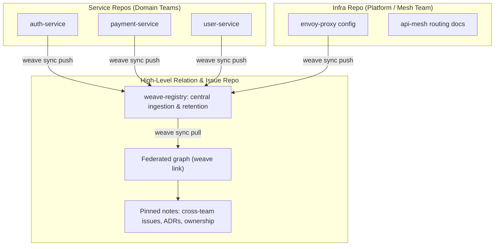

# User Intent & Deployment Matrix: `weave-graph`

> **Document ID**: `user_intent.md`
> **Topic**: How `weave-graph` operates across user scale (Single / Multi / Custom) and repo topology (Single Repo / Monorepo / Multi-Repo), which Cargo features each deployment enables, and the status of the 10 gaps originally identified here.
> **Project**: `weave-graph` (CLI: `weave`)
> **Status**: Historical deployment-intent reference. [plan.md](plan.md) is the approved product direction; [issues.md](issues.md) records gaps. Older examples here must be checked against current CLI/configuration before use.

---

## 1. The Two Axes

Every real deployment is a point on two independent axes:

*   **User scale**: Single User → Multi User (Multiple) → Custom
*   **Repo topology**: Single Repo → Monorepo → Multi-Repo (Federated)

Two mechanisms position a deployment on the grid, and they are deliberately separate:

*   **`mode`** (`single` | `multiple`, `plan.md` §1.3) — a runtime config field affecting only which conveniences the CLI surfaces. There is no `custom` value; see §5.
*   **Cargo features** (`plan.md` §0.2) — compile-time capability selection, all default-off. A zero-feature build is a complete single-user tool.

**Repo topology is driven by features; user scale is driven by `mode` plus infrastructure config.** The two compose freely: a solo developer can enable `federation` for a local multi-repo setup without ever touching team configuration.

---

## 2. The 3×3 Deployment Grid

| | **Single Repo** | **Monorepo** | **Multi-Repo (Federated)** |
| :--- | :--- | :--- | :--- |
| **Single User**<br>`mode = "single"` | **Features: none.** Default build. Local `.weave/graph.db`, no CI cache, no hub, no network stack linked in. Full reindex on a fresh clone is trivial at this scale. | **Features: none** (optionally `docs`). AST sparsification and `uint32` CSR compaction carry real weight here (500k+ symbols under the `<80MB` target). L0 commit-snapshot cache (`.weave/cache/<sha>.idx`) drives fast branch switching. LOD visualization (`plan.md` §1.3a) is what keeps `weave report` readable. | **Features: `federation`.** `weave link repo-a repo-b` composes isolated subgraphs locally with composite keys (`[repo_id]::[path]::[symbol]`). **No hub, no network** — `federation` deliberately excludes networking. Single machine, nothing to sync. |
| **Multi User (Multiple)**<br>`mode = "multiple"` | **Features: none required.** `weave init --mode multiple` emits a native CI-cache snippet (L1, prefix-fallback keys) so PRs don't cold-index. Each teammate's `.weave/graph.db` stays a personal, disposable rebuild — correct, since it is derived data. | **Features: none required** (optionally `docs`). The main cost is CI repetition; L1 caching plus `weave index --incremental` covers it. Watch the L1 crossover: once restore + decompress approaches a cold index, caching stops paying (`design-proposals.md` §1.1). | **Features: `federation`** (+ optional `provenance`). Local hub-and-spoke composition with `contract_hash` staleness detection across sibling checkouts — **no hosted service**. `weave check-contracts` gates CI on divergent boundary contracts. |
| **Custom**<br>`mode = "multiple"` + auth | **Features: `rbac`.** Query-layer masking (`plan.md` §3.1) applies to one high-value repo. Enforcement inside the storage/traversal boundary means CLI, report, export, and MCP all inherit one guard. | **Features: `rbac`, `policy-lint`, `otel`.** Policy Linter blocks boundary-violating PRs; OTel overlays runtime latency onto graph nodes. If CI cannot use a cache primitive at this scale, add `hub` for snapshot hydration. | **Features: `custom` bundle** (`team` + `hub` + `rbac` + `otel` + `policy-lint`). Central Graph Registry with `repo_id`-partitioned disk-spool ingestion; `AuthProvider` supplies identity. The fully-specified cell. |

### 2.1 The `[HUB]` Tier Is Orthogonal and Rare

`hub` appears in only two cells above, both optional. It is **not** a rung on the user-scale ladder — a 50-person team can run indefinitely on L1 CI caching with `hub` disabled and lose nothing but cross-machine warm starts. It is justified by three narrow conditions (`plan.md` §1.3): CI without a usable cache primitive, monorepos where even an incremental delta off a stale cache is slow, or a deliberate want for warm fresh-clone starts. `[hub] url` left unset is a fully supported permanent state.

### 2.2 `slm` Is Orthogonal to Both Axes

`slm` (Phase 2, `plan.md` §2.4) appears in no cell above because it does not belong on this grid. It is a **per-developer terminal convenience**, independent of repo topology and user scale alike: a solo developer on one repo and an engineer at a large org on a 100-repo federation get the same thing from it — `weave ask "who calls X?"` instead of exact query syntax.

Two consequences worth stating plainly:

*   **It is not the AI-agent path.** Every cell above serves AI agents through the deterministic MCP surface (`plan.md` §1.5), which never involves a model. `slm` exists for the *human* who does not want to learn query syntax or pay a frontier-model subscription to ask the graph a question. Adding it changes nothing about how agents consume the graph.
*   **Its cost is opt-in and lazily paid.** Compiling `slm` adds `0 MB` idle RSS — weights load on first `weave ask` only, never during `weave index` or `weave serve --mcp`. A resident 0.5B model costs roughly 380 MB *while in use*, on top of the core's `<80MB`.

Its clearest fit is the offline or air-gapped case: full natural-language access to the graph with zero network egress, which no cloud model can offer at any tier.

---

## 3. Gap Status

The earlier gap-resolution discussion is summarized in [plan.md](plan.md) and the current gap status is in [issues.md](issues.md). The deleted `design-proposals.md` source note is not a current reference.

### 3.1 Indexing

| # | Gap | Status | Where Resolved |
| :--- | :--- | :--- | :--- |
| 1 | No CI hydration path | ✅ Resolved · re-scoped `[HUB]` | `plan.md` §2.3 — merge-base snapshot pull, then local fast-forward, **plus mandatory retention** (unpruned snapshots grow by GB/month). Does not apply to default Team mode, which has no hub. |
| 2 | No delta conflict resolution | ✅ Resolved · re-scoped `[HUB]` | `plan.md` §2.3 — publish only on merge to default branch (eliminates races by construction); `409` → runner republishes a full snapshot rather than any server-side rebase. |
| 3 | No contract-staleness story | ✅ Resolved · widened to `[TEAM]` | `plan.md` §2.3 — SHA-256 over sorted canonical *exported* declarations, so formatting and private refactors cause no false staleness. Works locally across sibling checkouts; needs no hub. |
| 4 | Unverified large-diff assumption | ✅ Resolved | `plan.md` §1.2a — configurable bailout at max(100, 0.10 × N_total), then a crash-safe temp-file rebuild with atomic rename. |

### 3.2 Visualization

| # | Gap | Status | Where Resolved |
| :--- | :--- | :--- | :--- |
| 5 | No visualization scaling strategy | ✅ Resolved | `plan.md` §1.3a — four LOD tiers with a 200-node canvas budget, reusing the Louvain implementation already required for module clustering. LOD 3 on demand only. |
| 6 | RBAC-blind visualization | ✅ Resolved, **with the enforcement point corrected** | `plan.md` §3.1 — masking moved to the **query layer**, not the export path. Both earlier proposals put it in export only, which would have left the MCP server (the primary interface) returning unmasked nodes while the diagram looked governed. Watermark comments dropped as non-controls. |
| 7 | No refresh/staleness model | ✅ Resolved | `plan.md` §1.3a — visible provenance badge (commit SHA, branch, index time, `Static Snapshot`) pinned at canvas origin. Live-watch daemon explicitly deferred. |

### 3.3 Performance & Operations

| # | Gap | Status | Where Resolved |
| :--- | :--- | :--- | :--- |
| 8 | Benchmarks are projections, not measurements | ✅ **Resolved** | `performance_compare.md` split into Target SLOs vs. Empirical Benchmark Suite (`benches/` with `criterion`); Phase 1 Exit Gate protocol and measurement registry established. |
| 9 | Single-writer DB on shared filesystems | ✅ Resolved | `plan.md` §1.4 — `statfs` network-FS detection with **warn-and-refuse** as the default (relocation opt-in, since silently moving user data is worse than a clear error), `fslock` advisory locking, and read-only shared snapshots requiring a **non-WAL** journal. |
| 10 | No registry back-pressure | ✅ Resolved · `[CUSTOM]` | `plan.md` §3.1 — `repo_id`-partitioned disk-spool ingestion (sequential per repo, parallel across repos), `202`/`429` with `Retry-After`. Redis/SQS excluded by default; rate limits flagged for calibration against real merge rates. |

### 3.4 Additional Issues Found While Resolving These

Not in the original 10, surfaced during the resolution pass:

*   **Dangling-edge corruption** (`plan.md` §1.2a) — the per-file purge in earlier drafts deleted only outbound edges, leaving inbound edges pointing at deleted nodes. This would have silently corrupted `weave_trace_calls` and `weave_impact_radius` on every incremental reindex. Fixed to purge both directions, with a required regression test.
*   **Cache key that never hits** (`plan.md` §1.3) — "keyed by tree-sha" would miss on every run, since a tree-sha changes every commit. Corrected to prefix-fallback restore keys.
*   **Missing visited set on traversals** (`plan.md` §1.2a) — intra-repo cycles are ordinary; Tarjan's SCC at the federation level solves a different problem and does not substitute.
*   **MCP server bind scope** (`plan.md` §1.3) — `weave serve --mcp` now binds localhost-only by default, since the graph exposes full source structure.

---

## 4. Feature Selection by Deployment

Practical mapping from what a user has to what they should compile:

| Situation | Build |
| :--- | :--- |
| One person, one repo | `cargo install weave-graph-cli` (no features) |
| One person, many repos | `--features federation` |
| Wants Obsidian/Markdown linking | add `docs` |
| Team, ordinary CI | no features needed; run `weave init --mode multiple` for the L1 cache snippet |
| Team, multi-repo | `--features team` (= `docs` + `federation`) |
| Team wanting cross-machine warm starts | add `hub` *(rare)* |
| Org needing access control | `--features custom` + `[auth] provider` |
| Python/data-science consumer | add `python` |
| Human wants to query the graph in plain English, no cloud cost | add `slm` — Phase 2, `plan.md` §2.4, full spec `slm-spec.md`. **Never needed for AI-agent use**; agents already emit exact MCP tool calls |
| Offline / air-gapped and wants NL access | add `slm`; runs fully on CPU with no egress |

---

## 5. Resolved: Custom Has No Separate `--mode`

`weave init` keeps exactly two modes, `single` and `multiple`. Custom is **`--mode multiple`** plus two config fields and two features:

1.  `[hub] url` pointed at the Phase 3 Centralized Graph Registry *(feature: `hub`)*.
2.  `[auth] provider` set to an `AuthProvider` implementation — Okta / Azure AD / SAML / OIDC *(feature: `rbac`)*.

Multiple mechanics do not change at custom scale; only the hub target and whether an auth provider gates access change. A third `custom` mode would be a second name for the same fields being set.

**Multiple mode requires zero Phase 3 infrastructure — and by default, no hosted service at all.** The default Multi User configuration is the CI provider's own cache primitive plus `weave index --incremental`: no `hub_url`, no self-hosting, nothing to operate. Full multi-repo federation comes from `federation`, which is local-only.

Consequently the Custom row is mechanically identical to the Multi User row for indexing and caching. The only differences are which hub it points at (if any) and whether `AuthProvider` gates the query layer.

---

## 6. Usage Samples & Configuration Walkthroughs

The unified `weave` binary operates on a clear contract: **`mode` sets baseline defaults, and optional capabilities activate on demand whenever their config section is present.**

```text
                     Default Mode Baseline vs. Opt-In Features
┌─────────────────────────────────────────────────────────────────────────────┐
│ MODE: `single` (Default)                                                    │
│ • Runtime baseline only: Core AST Indexing. Enables no Cargo feature —      │
│   a mode never turns on a compile-time capability (Core Invariant 4).      │
│ • Footprint: 100% local on one machine, zero network calls                  │
├─────────────────────────────────────────────────────────────────────────────┤
│ MODE: `multiple`                                                            │
│ • Runtime baseline: `single`'s footprint + native CI-cache snippet.         │
│ • Also enables no Cargo feature — `federation` below is a separate opt-in. │
├─────────────────────────────────────────────────────────────────────────────┤
│ OPT-IN ANYTIME (requires building/installing with the matching             │
│ `--features` flag, then adding the section to `.weave/config.toml`):       │
│ • Doc/Wikilink Indexing ─► `--features docs` (no config section needed)    │
│ • Multi-Repo Federation ─► `--features federation`, then `weave link` or   │
│                            add `[federation]` with `linked_repos = [...]`  │
│ • Remote Hub Sync ──────► `--features hub`, then add `[hub]` + `url`       │
│ • Cryptographic Trust ──► `--features provenance`, then `[provenance]`     │
│ • Local NL Router ──────► `--features slm`, then add `[slm]` + `model`     │
└─────────────────────────────────────────────────────────────────────────────┘
```

### 6.1 Sample 1: Single Developer (Default Zero-Config)

```bash
# First-run setup: creates .weave/config.toml, auto-gitignores .weave/, wires MCP
weave init --mode single

# Index repository and query callers
weave index
weave query "callers(AuthService.verify)"
```

**Resulting `.weave/config.toml`**:
```toml
mode = "single"

# Automatically active:
# - Core AST indexing (tree-sitter, SQLite, CSR memory)

# Optional (requires building/installing with --features docs — a mode never
# turns this on; compiling the feature in is what activates it):
# Markdown/Obsidian doc linking and .canvas exports. No config section needed.

# Optional (requires --features federation): solo developers with multiple
# local repos can enable federation anytime:
# [federation]
# linked_repos = ["../sibling-lib"]
# staleness_policy = "warn"
```

> **Note**: On a binary built with `--features federation`, running `weave link ../sibling-lib` automatically appends the `[federation]` section with `linked_repos` to `.weave/config.toml`.

---

### 6.2 Sample 2: Multiple Mode (Multi-Repo & Native CI Cache, Zero Hosted Server)

```bash
# Initialize for team collaboration (auto-generates [federation] section)
weave init --mode multiple

# Link sibling microservice repository locally
weave link ../payment-service ../inventory-service

# Verify boundary contracts before pushing PR
weave check-contracts
```

**Resulting `.weave/config.toml`**:
```toml
mode = "multiple"

[federation]
linked_repos = [
  "../payment-service",
  "../inventory-service"
]
staleness_policy = "warn"    # warn (diagnostic) | strict (fails CI) | ignore
```

*Surfaces native CI cache snippet with prefix-fallback restore keys (no server needed):*
```yaml
# In .github/workflows/ci.yml
- name: Restore Weave Graph Cache
  uses: actions/cache/restore@v4
  with:
    path: .weave/
    key: weave-${{ runner.os }}-${{ github.ref_name }}-${{ github.sha }}
    restore-keys: |
      weave-${{ runner.os }}-${{ github.ref_name }}-
      weave-${{ runner.os }}-main-
```

---

### 6.3 Sample 3: Enabling Advanced Features on Demand (`hub`, `provenance`, `slm`)

Any user in `single` or `multiple` mode can turn on advanced subsystems without re-indexing or re-installing:

```toml
mode = "multiple"

[federation]
linked_repos = ["../payment-service", "../inventory-service"]
staleness_policy = "strict"

# 1. OPT-IN: Remote Hub Sync (Only for teams wanting cross-machine warm starts)
[hub]
url = "https://weave-hub.internal.corp"
snapshot_retention = 20

# 2. OPT-IN: Cryptographic Merkle Provenance (Lodestone Nexus integration)
[provenance]
provider = "lodestone"
verify_commit_signatures = true

# 3. OPT-IN: Local Offline Natural Language Router (`weave ask` / `weave journal`)
[slm]                                # requires feature = slm
model = "qwen2.5-coder-0.5b-q4_k_m"  # never auto-upgraded; weights not bundled
lazy_load = true                     # must stay true: 0 MB idle cost until first `weave ask`
```

---

## 7. Deep Dive: `staleness_policy` Mechanics (Deterministic & Zero-LLM)

A critical architectural invariant in `weave-graph` is that **contract staleness detection never requires an SLM, LLM, network call, or arbitrary time-based TTL**. It operates 100% deterministically on pure syntax trees and cryptographic hashing.

```text
┌─────────────────────────────────────────────────────────────────────────────┐
│               DETERMINISTIC BOUNDARY CONTRACT PIPELINE (ZERO-LLM)           │
├─────────────────────────────────────────────────────────────────────────────┤
│ 1. Tree-Sitter AST   ──► Filter Exported Public Declarations Only            │
│ 2. Canonicalization  ──► Strip Bodies, Whitespace, & Comments; Sort Symbols │
│ 3. Cryptographic Hash──► Compute SHA-256 (`contracts.contract_hash`)        │
│ 4. Cross-Repo Match  ──► Compare `expected_hash` == `current_hash`           │
└─────────────────────────────────────────────────────────────────────────────┘
```

### 7.1 How Contract Staleness Is Detected (Zero-LLM Core)

1. **Canonical AST Extraction**:
   When indexing a repository, Tree-sitter parses the source code and isolates **exported public symbols only** (public functions, struct definitions, trait interfaces, gRPC/OpenAPI endpoints).
2. **Canonical Normalization**:
   All function bodies, private internals, comments, and whitespace are discarded. Declarations are sorted alphabetically to prevent formatting or internal refactorings from causing false staleness.
3. **Deterministic SHA-256 Hashing**:
   `weave` calculates a SHA-256 hash across the canonical public AST and records it in SQLite (`contracts.contract_hash`) with `source_commit_sha`.
4. **Cross-Repo Boundary Comparison**:
   When `repo-a` links to `repo-b` (`weave link ../repo-b`), the cross-repo boundary edge in `repo-a` stores `expected_target_hash`.
   * If `repo-b` modifies an internal function implementation: **hash remains identical** (zero false positive).
   * If `repo-b` changes a parameter type, return type, or deletes a public method: **hash diverges** (`expected_hash != current_hash`).

---

### 7.2 Enforcement Modes (`staleness_policy`)

The `staleness_policy` setting in `.weave/config.toml` dictates how the engine reacts upon detecting divergent contract hashes:

```toml
[federation]
linked_repos = ["../payment-service"]
staleness_policy = "warn"    # Options: "warn" | "strict" | "ignore"
```

| Policy | Behavior on Contract Divergence | Target Environment |
| :--- | :--- | :--- |
| **`"warn"`** *(default)* | Non-blocking diagnostic. Appends a warning to CLI and MCP outputs (`"⚠️ Warning: Public contract drift detected in ../payment-service (PaymentClient.charge modified)"`). Graph queries succeed. | Local development (`single` or `multiple`) |
| **`"strict"`** | Enforces zero drift. `weave check-contracts` exits with **non-zero exit code (`code 1`)**, failing CI or pre-commit hooks until the consumer updates to match the upstream contract. | CI / PR validation gate |
| **`"ignore"`** | Suppresses all contract divergence diagnostics during traversal. | Microservices with decoupled deploy cadences |

---

### 7.3 What Does the Optional `slm` Add (If Ever Enabled)?

| Dimension | Default Engine (No SLM) | With Optional `--features slm` |
| :--- | :--- | :--- |
| **Structural Breaking Changes** | **100% covered** via canonical AST SHA-256 (parameter changes, missing symbols, return type mismatch) | Same underlying deterministic AST hashing |
| **Execution Overhead** | <1ms hash comparison, zero RAM overhead, 100% offline | <1ms hash comparison |
| **Semantic Drift Detection** | N/A (structural only) | Conceptual future capability, not part of today's `[slm]` schema (`plan.md` §0.3 — see §6.3): comparing natural language docstrings across repos (e.g. flags if repo A's docstring says *"amount in cents"* while repo B assumes *"dollars"* despite both being `u64`) |

*Summary: Contract staleness verification is mathematically complete in the default base build without any SLM.*

---

## 8. Enterprise & Cross-Team Real-World Use Cases

### 8.1 Use Case 1: Committed Per-Repo Knowledge with Cross-Team Relation & Issue Repos
In large organizations, infrastructure teams (e.g. API mesh, proxy, routing) manage cross-cutting policies across microservices owned by independent domain teams without owning the underlying service repositories.



#### The Architecture Rules:
1. **Never Commit Binary Indexes**: `.weave/graph.db` remains local and gitignored. Rebuilding from source takes milliseconds-to-seconds (`weave index`), preventing binary merge conflicts and permanent working-tree dirtiness.
2. **Commit Knowledge Sources**: Architecture docs (`.md` with wikilinks) and pinned note scripts (`weave note pin`) travel directly with git.
3. **Cross-Team Relations**: `weave link` namespaces symbols `repo_id::path::symbol` (e.g. `EnvoyProxy.v2_filter` -> `auth-service::src/jwt.rs::JwtVerifier.validate`), creating a live cross-repo edge without manual wiki maintenance.
4. **Cross-Team Issues & ADRs**: `weave note pin` attaches warnings or architectural decisions to upstream symbols (e.g. `PaymentQueue.push`). These notes surface immediately during AI queries, CLI inspections, or MCP tool executions across all consuming repositories.

---

### 8.2 Use Case 2: Cross-Repo Integration with Masked Internals (Public Contracts vs. Secret Source)
A common enterprise security dilemma:
* **Context**: An engineer building `payment-service` needs to integrate with `authentication-service`'s 2-step approval API (`verify_2step_approval`).
* **Security Constraint**: Payment engineers have zero read permissions for `authentication-service`'s source code (which houses confidential biometrics, hardware vault decryption, and cryptographic salts).
* **Solution**: Query-layer RBAC (`weave query --as payment_dev`) collapses unauthorized subgraphs to public contract boundaries.

```text
┌────────────────────────────────────────────────────────────────────────┐
│                     authentication-service                             │
│                                                                        │
│  [PUBLIC CONTRACT ENTRYPOINT] (Visible to payment-service engineer)    │
│  pub fn verify_2step_approval(req: ApprovalRequest) -> Result<Ticket>  │
│  /// Documented Contract: Step 1 (biometric) followed by Step 2 (TOTP) │
│                                                                        │
│  ───────────────────────────────────────────────────────────────────   │
│                                                                        │
│  [PRIVATE INTERNALS] (MASKED as <rbac: hidden>)                        │
│  • fn decrypt_hardware_token_vault()                                   │
│  • fn query_mfa_backup_keys()                                          │
│  • Raw database tables, crypto keys, internal file paths               │
└────────────────────────────────────────────────────────────────────────┘
```

#### Traversal & Verification Workflow:
1. **Federated Linkage**: `payment-service` declares `authentication-service` in `.weave/config.toml`'s `[federation.peers]`.
2. **Masked Traversal**:
   * Public entry points, parameter types (`ApprovalRequest`), return types (`ApprovalTicket`), and doc comments are fully exposed.
   * Deep internal hops (`--depth 3`) return `<rbac: hidden>` stand-ins, preserving topology without data leaks.
3. **Automated Contract Gating (`weave check-contracts`)**: Payment CI verifies public AST hashes against the auth service. If the auth team modifies method signatures or types, payment CI fails immediately with drift diagnostics even without access to auth service internals.
4. **Policy Linting (`weave policy lint`)**: Ensures payment modules properly invoke approved auth entry points while skipping unclassifiable internal edges.

---

### 8.3 Use Case 3: SCIM 2.0 User Lifecycle & Single-Guard Enforcement
For enterprise identity lifecycle management:
1. **SCIM Synchronization (`weave rbac serve-scim`)**: Listens on loopback to ingest user provisioning, deprovisioning, and role assignment events from corporate IdPs (Okta, Azure AD).
2. **Unified Single-Guard Invariant**: One single `RbacGuard` protects CLI commands, architectural reports (`weave report`), canvas exports, policy linters (`weave policy lint`), and AI agent MCP tool calls. A user restricted from seeing internal source code receives identical masked views across all tools.

